# When Recursive Execution Helps—and When It Doesn’t: A Cost–Accuracy Benchmark under Local Ollama and Hosted Backend Constraints

Mayanka Gupta, Abhigyan Shekhar, Parth Bhat, Mayank Gupta, Anshul Desai, Anagha Avinash

## Abstract

This paper presents a systems-level benchmark of
direct large language model execution (`LLM`) versus
recursive agentic execution (`RLM`) across seven task
families spanning short reasoning, long-context
retrieval, structured extraction, planning,
document-grounded question answering, under-
specification, and stochastic optimization. The primary
evidence is a controlled local Ollama batch on
`qwen2.5:7b` with ten paired runs per task. Under this
constrained local deployment, recursive execution is
Pareto-dominated in cost-accuracy terms: it uses
more tokens on every benchmark family, is slower on
six of seven, and produces no benchmark-family
accuracy gain under the task-specific rubric. The lone
latency exception, Clinical Long Context, is a
fast-failure regime in which recursive execution returns
more quickly only because answer quality collapses.

Across these local benchmark families, recursive
execution is therefore Pareto-dominated by direct
inference.

A same-family local scale probe on `qwen2.5:14b`
leaves that conclusion largely intact. The first five
task families were rerun for five paired repetitions
each, while the two heaviest TSP families were capped
at three paired repetitions due to local runtime cost
and instability. The larger model increases absolute
capability on some direct-call tasks, but does not
convert recursive execution into a better local operating
point.

A hosted Groq stress test using `llama-3.3-70b-versatile`
reveals a distinct deployment failure mode. Recursive
execution produces **token burst instability**: because
one user query expands into multiple dependent backend
calls with repeated wrapper prompts, trace growth, and
intermediate state, token consumption becomes bursty
rather than bounded. Under provider tokens-per-day
limits, these bursts cause fatal mid-execution failures
more often than matched direct calls. On the hardest
Groq tasks, both paths eventually fail, but recursive
execution fails earlier and more frequently. A lighter
Gemini archival supplement is retained only as
qualitative evidence of backend dependence, including
one under-specified TSP counterexample where recursion
produced the stronger benchmark response. Taken
together, the results identify a clear gap between the
theoretical promise of recursive decomposition and its
practical deployment cost under real system
constraints.

Our central finding is that recursive execution is
systematically dominated by direct inference under
realistic deployment constraints, offering no accuracy
benefit while incurring significant cost overhead.

Index Terms—large language models, agentic systems,
recursive execution, local inference, Ollama, Gemini,
benchmark evaluation


## I INTRODUCTION

Direct prompting and recursive agentic execution are
often discussed as if they were competing reasoning
techniques. This paper evaluates a different question:
what happens when a direct model call is replaced by a
recursive runtime as a deployed system. The comparison
is therefore end-to-end rather than prompt-equated. In
one path, the model receives the benchmark prompt and
returns a final answer. In the other, the same model is
embedded inside a recursive runtime that adds a system
prompt, control loop, REPL and tool access,
intermediate-state management, and a finalization step.
The practical issue is not whether recursive
decomposition is appealing in theory, but whether
it improves answer quality enough to justify its systems
overhead in realistic deployments.

This work studies that question on seven applied task
families using a controlled local batch on Ollama with
`qwen2.5:7b`, pooled to ten paired runs per task, a
same-family local scale probe on `qwen2.5:14b`, and two
hosted supplements with different evidentiary roles.
The 7B local batch is the core evidence. It measures
what a practitioner would actually observe when
swapping a direct local call for a recursive runtime on
short reasoning, long-context retrieval, structured
extraction, planning, document-grounded question
answering, hallucination-sensitive under-specification,
and stochastic optimization tasks. The 14B local probe
tests whether that pattern changes under a larger model
from the same family. The hosted Groq batch is
retained as a quota-constrained deployment stress test,
while the Gemini archive is retained only as qualitative
evidence of backend dependence.

While prior work evaluates reasoning capability, we
evaluate deployment viability under constrained
systems.

The contribution is therefore a systems benchmark, not a
new reasoning method. Prior recursive-execution work
asks whether additional structure can improve
capability. This paper asks whether deploying that
structure as a runtime is operationally worthwhile once
latency, token usage, reliability, and provider
constraints are treated as first-class metrics. RLM is
an execution strategy, not an intrinsic capability
upgrade. Under weaker local models, recursion can
amplify error rather than correcting it. Under hosted
provider constraints, it can also fail as a system before
it fails as a reasoning method.

That distinction matters because most prior work on
recursive reasoning, agentic control, and structured
inference is optimized for capability demonstration
rather than deployment measurement. Recursive Language
Models report striking long-context gains by converting
long prompts into environments navigated through
recursive self-calls [8]. Recent reproduction work shows
that these gains can persist on harder benchmarks, while
also showing that deeper or unnecessary recursion can
sharply increase runtime and token cost and degrade
simpler settings [9]. These findings are important, but
they do not answer the operational question faced by
practitioners: when a direct `LLM` call is replaced by a
recursive runtime, what happens to latency, token
consumption, reliability, and final answer quality
under actual serving constraints?

The central empirical result is consistent across the
local measurements. Under the primary `qwen2.5:7b`
batch, recursive execution is Pareto-dominated in
cost-accuracy terms: it is more token-intensive on
every benchmark family, slower on six of seven, and
achieves no benchmark-family accuracy gain. The same-
family `qwen2.5:14b` probe does not overturn that
result. The larger model improves some direct-call
outcomes, but recursive execution still fails to recover
a better local cost-accuracy operating point. The
hosted Groq runs reveal an additional systems problem:
recursive execution is not merely slower on average, but
more fragile under provider budget constraints because
it produces bursty token demand rather than a single
bounded request. We refer to this systems phenomenon as
**token burst instability**.

We reinterpret recursive execution through the lens of
token burst instability, which explains both its cost
amplification and its deployment fragility.

This shift in emphasis is the paper’s central novelty.
The benchmark shows that recursion's benefits are
conditional and must be demonstrated against the full
operational cost of the runtime that implements it.

The paper uses four evidence sources.

1. **Controlled local batch.**
   - backend: `ollama`
   - model: `qwen2.5:7b`
   - paired runs per task: `10`
   - batch folder:
     `benchmark_runs/20260410-pooled-ollama-qwen2.5-7b-10runs`
2. **Same-family local scale probe.**
   - backend: `ollama`
   - model: `qwen2.5:14b`
   - paired runs per task: `5` for the first five
     benchmark families and `3` for the two heaviest
     TSP families
   - batch folder:
     `benchmark_runs/20260410-082745-ollama-qwen2.5-14b`
3. **Hosted Groq quota-constrained stress test.**
   - backend: `groq`
   - model: `llama-3.3-70b-versatile`
   - paired runs per task: `5`
   - batch folder:
     `benchmark_runs/20260410-125019-groq-default-model`
   - note: all rows were executed and logged, but some
     terminate in fatal provider-side quota failures
4. **Hosted Gemini archival artifacts.**
   - recovered from the benchmark branches cloned for this update
   - normalized under:
     `benchmark_runs/20260409-gemini-archival-artifacts`

The emphasis of the paper is operational. It asks whether
replacing a direct `LLM` call with a recursive runtime is
practically worthwhile under both a local open-weight
deployment and a preserved hosted Gemini archive, and
how much that replacement costs relative to a plain
single-pass baseline over the same task families.

## II LITERATURE REVIEW

### A Recursive and Structured Reasoning

Prior work on recursive and structured computation es-
tablished the broader intuition that hierarchical de-
composition can improve representation quality when
tasks are naturally compositional [1]. More recent in-
ference-time methods such as chain-of-thought, tree-of-
thought, and self-refinement externalize intermediate
reasoning into explicit text or search trajectories [2,
3, 4]. Agentic systems extend this move from prompting
into runtime control flow by introducing subgoals,
tools, memory management, and recursive execution. In
this lineage, Recursive Language Models are especially
relevant because they treat long prompts as navigable
environments and use recursive self-calls to improve
long-context performance [8].

The present paper is complementary to that literature
but asks a different question. Prior work primarily
evaluates whether additional structure can improve
capability. This paper evaluates whether deploying that
structure as a runtime is operationally worthwhile once
latency, token cost, instability, and provider
constraints are treated as first-class metrics. A
recursive execution policy can be effective as a
reasoning scaffold while still being unattractive as a
production system.

This distinction is especially important because most
prior recursive and agentic evaluations effectively
assume scale: strong hosted models, generous token
budgets, and settings in which capability is the primary
metric. We instead test the constrained regime in which
resource budgets, latency ceilings, and provider quotas
govern practical deployment. A method that improves
reasoning quality in theory can still be unattractive in
practice if its systems cost dominates under these
constraints.

### B Agentic Memory and Long-Context Systems

Another strand of literature studies how models handle
contexts that exceed the practical limits of a single
forward pass. Systems such as MemGPT argue that long-
context performance is often a systems problem
involving memory management, retrieval, and state
coordination rather than a pure architecture problem
[5]. These contributions are relevant because RLM, like
other agentic runtimes, pays an execution tax in
exchange for memory-management flexibility. The
benchmark tasks in this study therefore test not only
model intelligence, but also whether iterative
orchestration helps or hurts performance relative to a
direct full-context call.

### C Long-Context Evaluation and Retrieval

Recent evaluation work warns that many nominal long-
context tasks are dominated by retrieval rather than
genuine multi-step synthesis [7]. This distinction
matters here. If a task is fundamentally high-recall
extraction from a provided document, a direct full-
context call may outperform an agent that repeatedly
serializes, filters, and re-queries the same evidence.
That framing helps explain why direct prompting wins
the retrieval-heavy tasks in this benchmark while the
clearest recursive success survives only in hosted
counterexamples on grounding-sensitive prompts.

### D Reliability and Failure Surfaces

A recurring theme in the literature on tool-augmented
and multi-step agents is that extra reasoning structure
introduces both benefits and new failure modes. Inter-
mediate traces improve observability, make refusals more
principled, and create opportunities for self-correction.
However, every additional loop, tool invocation, or de-
composition step can introduce latency, state drift,
formatting errors, and failure propagation from an
early incorrect decision. Recent reproduction work on
Recursive Language Models sharpens this point: shallow
recursion can help on harder reasoning tasks, but deeper
or unnecessary recursion can sharply increase time and
token cost and can underperform on simpler settings
[9]. The present benchmark extends that corrective
perspective from capability evaluation into deployment
measurement.

### E Research Gap

Methodology work on agent benchmarking now stresses
that evaluation design errors can materially distort re-
ported performance. Establishing Best Practices for
Building Rigorous Agentic Benchmarks argues that
benchmark hygiene, execution control, and failure ac-
counting are central determinants of valid agent com-
parisons [10]. This paper aligns with that perspective
in two ways. First, it treats the controlled local batch,
hosted quota stress test, and archival hosted supplement
as evidentially different rather than pooling them into a
single leaderboard. Second, it evaluates final user-
visible outputs and end-to-end failure states rather
than rewarding intermediate traces.

This methodological stance also explains two deliberate
design choices. We do not include chain-of-thought or
self-consistency baselines because the paper is not
comparing prompting techniques; it measures the
deployment substitution of a direct `LLM` call with a
recursive runtime. We also do not prompt-equate the
two paths, because the wrapper prompt and control
logic are part of the recursive system being measured.
These are scope decisions tied to the systems question,
not omissions in a prompting paper.

Taken together, prior work provides strong conceptual
arguments for structured reasoning, recursive decompo-
sition, and agentic control, but it still leaves a prac-
tical gap. Most studies evaluate specialized capability
benchmarks, stronger hosted models, or new frameworks.
They rarely compare single-pass execution against re-
cursive runtime execution on the same applied task
families with common logs, common metrics, and ex-
plicit attention to latency, token cost, failure rate,
and provider constraints. This paper addresses that
gap. Its contribution is not another argument that
recursion can help in principle, but an empirical ac-
count of when recursive execution becomes operationally
expensive, unstable, or quota-fragile in practice.

## III METHODOLOGY

### A Experimental Design

The evaluation follows a controlled parallel-harness
design. Each task is executed twice: once through a
direct local model call and once through the RLM
framework. Using the same underlying local model for
both paths reduces model-capability confounds and
isolates the effect of execution strategy. All raw outputs,
wall-clock timings, and token usage were logged to
markdown files under the benchmark batch directory.

### B Task Selection

Task families were selected to cover the capability
dimensions most relevant to agentic versus direct
prompting comparisons. The suite spans short reasoning,
long-context retrieval, structured extraction, planning,
PDF question answering, hallucination detection, and
stochastic optimization. Table 1 summarizes the task
family, domain, and challenge type for each benchmark.
The selected tasks are intentionally not inherently
recursive. They represent common real-world workloads
such as retrieval, extraction, planning, and structured
reasoning, where practitioners must decide whether a
recursive runtime provides measurable benefit over a
single-pass baseline.

### C System Configurations

**LLM Path:** A single prompt is issued to the local
Ollama endpoint and the response is recorded without
intermediate processing. This path serves as the local
production baseline for latency- and cost-sensitive
deployments.

**RLM Path:** The same prompt is executed through the
RLM framework, which adds an iterative reasoning loop,
REPL access, and tool invocation. Intermediate
reasoning steps are observable, enabling self-correction
across iterations before a final response is produced.
Configuration parameters were held fixed within the
local benchmark runner for the completed batch.

This study evaluates recursive execution as a deployed
system rather than as an isolated reasoning primitive.
The recursive path is measured with its wrapper prompt,
control loop, tool and REPL affordances, and
finalization logic because those are the components a
deployment actually inherits. The direct path is the
production-style baseline: a single call with the
benchmark prompt and no orchestration overhead. The
goal is to compare whole-system cost-accuracy
trade-offs, not a prompt-only effect under artificial
matching.

### D Evaluation Metrics

The revised manuscript reports both systems metrics and a
task-specific post-hoc accuracy audit for the controlled
local batch.

1. **Latency (seconds):** wall-clock time from invocation
   to final response.
2. **Token Usage:** total input plus output tokens per
   run.
3. **Exit Status:** whether a run completed cleanly.
4. **Accuracy:** deterministic task-specific rubric scores
   computed from the saved markdown outputs.
5. **Descriptive 95% Confidence Intervals:** Student-`t`
   half-widths over the repeated local runs for wall time,
   total tokens, and accuracy.

The accuracy audit is benchmark-specific rather than a
single generic metric. Retrieval tasks are scored by exact
fact recovery, the planning task is scored by a grounded
checklist, the under-specified TSP is scored as a refusal
benchmark, and the stochastic TSP uses a partial-credit
policy-and-cost rubric. Confidence intervals are reported
as descriptive uncertainty estimates rather than as a
high-power significance analysis. Nonzero-exit runs receive an
accuracy of zero because the evaluation is end-to-end.

### E Scoring and Data Collection

Timings, token counts, and accuracy scores were extracted
directly from saved markdown logs and normalized into:

- `raw_data.csv`
- `aggregate_metrics.csv`
- `accuracy_raw.csv`
- `accuracy_aggregate.csv`

The batch also includes a machine-generated
`SUMMARY.md`, a systems report, and an accuracy report:

- `benchmark_runs/20260410-pooled-ollama-qwen2.5-7b-10runs/SUMMARY.md`
- `benchmark_runs/20260410-pooled-ollama-qwen2.5-7b-10runs/REPORT.md`
- `benchmark_runs/20260410-pooled-ollama-qwen2.5-7b-10runs/ACCURACY_REPORT.md`
- `benchmark_runs/20260410-082745-ollama-qwen2.5-14b/SUMMARY.md`
- `benchmark_runs/20260410-082745-ollama-qwen2.5-14b/aggregate_metrics.csv`
- `benchmark_runs/20260410-082745-ollama-qwen2.5-14b/accuracy_aggregate.csv`

### F Task Suite

Table 1 summarizes the seven benchmark pairs used in
the local run.

| # | Task | Domain | What the prompt asks for |
| --- | --- | --- | --- |
| 1 | Battle of the Bastards | Short reasoning | Read a short battle narrative and identify the main character plus the single most decisive ally. |
| 2 | AuthProxy Long Context | Retrieval | Answer five questions from a noisy long config document, including the current retry limit, the active-production sentence, and the failover implication for `AuthProxy-Primary`. |
| 3 | Clinical Long Context | Structured extraction | Answer five questions from a long clinical archive about subject `PT-2247`, including current allergy flag, the exact renal-monitoring sentence, and a grounded step-by-step protocol conclusion. |
| 4 | Launch Note App | Planning | Produce a structured 30-day launch plan for an AI note-taking app under fixed budget, team, and user constraints, with milestones, tasks, dependencies, tools, risks, and mitigations. |
| 5 | PDF Cersei Warning | PDF QA | Search only within the provided document text for the exact Cersei-to-Ned warning quote, or return `CONTEXT NOT ENOUGH` if it is not recoverable from context. |
| 6 | Under-specified TSP | Hallucination detection | Solve an 8-city branch-and-bound TSP even though the prompt omits the distance matrix; the intended benchmark behavior is to avoid inventing missing problem structure. |
| 7 | Stochastic Adaptive TSP | Optimization | Derive the optimal adaptive policy and exact expected cost for a fully specified 5-city stochastic TSP with multiplier uncertainty revealed on arrival. |

These prompts were chosen to cover different operational
failure surfaces. The first four emphasize direct answer
quality on short reasoning, long-context retrieval,
structured extraction, and planning. The PDF benchmark
adds strict document-grounded quote retrieval. The two
TSP benchmarks probe different reasoning regimes: one
is intentionally under-specified to test whether the
system invents missing data, while the other is fully
specified and tests whether the system can derive a
correct adaptive optimization policy under uncertainty.

### G Runtime Configuration and Reproducibility

The recursive path in this paper is the repository `RLM` implementation in `rlm/core/rlm.py`, executed through the local environment with the same model family used by the direct baseline.

Local controlled batch configuration:

- public code and artifact repository: `https://github.com/Abhigyan-Shekhar/rlm`
- evaluated revision branch: `https://github.com/Abhigyan-Shekhar/rlm/tree/codex/vllm-benchmark-rewrite`
- paired harness: `run_benchmark_pairs.py`
- backend shim: `benchmark_backend.py`
- baseline task scripts: `llm-test`
- recursive task scripts: `rlm-test`
- core recursive runtime: `rlm/core/rlm.py`
- scoring script: `scripts/build_accuracy_report.py`
- serving stack: Ollama via an OpenAI-compatible endpoint
- endpoint: `http://127.0.0.1:11434/v1`
- model: `qwen2.5:7b`
- host hardware for the local batch: Apple M4 MacBook Air, 10 CPU cores, 16 GB RAM (recorded post hoc at revision time rather than by the original run harness)
- sampling parameters: no explicit temperature or top-`p` override in the harness; provider defaults were used
- serving metadata: Ollama version, quantization tag, and effective context-window setting were not captured by the original run harness
- benchmark families: `7`
- paired runs per family: `10`
- task-specific custom system prompt: none
- prompt wrapping: the direct baseline uses the benchmark prompt only; the recursive path uses the repository default RLM system prompt from `rlm/utils/prompts.py` plus the benchmark prompt
- evaluation target: an end-to-end deployment comparison rather than a prompt-equated ablation; the recursive wrapper prompt is treated as part of the runtime being measured
- benchmark prompts and context documents: embedded in the paired task scripts above
- benchmark assets and logs: repo-relative artifact paths listed below

Same-family local scale probe configuration:

- serving stack: Ollama via the same OpenAI-compatible endpoint
- endpoint: `http://127.0.0.1:11434/v1`
- model: `qwen2.5:14b`
- batch folder: `benchmark_runs/20260410-082745-ollama-qwen2.5-14b`
- paired runs: `5` for `got`, `authproxy`, `clinical`, `launch_note_app`, and `pdf_cersei_warning`
- paired runs: `3` for `tsp_branch_bound` and `stochastic_tsp`
- rationale for reduced TSP counts: the heavier 14B recursive runs became substantially slower and repeatedly stalled under local resource pressure, so the final TSP rows are treated as a descriptive scale probe rather than as a co-equal replicate of the 7B ten-run batch
- scoring and log extraction: the same normalization and deterministic accuracy scripts were rerun over the 14B batch after completion

#### Table 1A. RLM Runtime Caps by Benchmark

| Benchmark | Max Depth | Max Iterations | Max Recursive Calls |
| --- | ---: | ---: | ---: |
| Battle of Bastards | 1 | 3 | - |
| AuthProxy | 1 | 3 | - |
| Clinical | 1 | 3 | - |
| Launch Note | 5 | 3 | - |
| PDF Cersei | 3 | 5 | 3 |
| TSP Missing Matrix | 3 | 6 | 3 |
| Stochastic TSP | 3 | 6 | 3 |

The direct `LLM` path performs a single completion call through the same backend shim without the iterative loop, REPL execution, or recursive subcalls. This makes the comparison strategy-level rather than model-level.

Because recursion budgets vary by benchmark family, the
reported cost numbers should be read as task-configured
runtime measurements rather than as a pure fixed-budget
orchestration overhead estimate. The comparison is
intentionally not prompt-equated: `RLM` is evaluated
with its wrapper prompt and runtime controller, while
the baseline is a production-style direct call. The
measured gap should therefore be interpreted as the
operational cost and benefit of replacing a direct call
with this runtime.

## IV RESULTS BY TASK

Task-specific recursive budgets for the per-benchmark summaries below are listed in Table 1A.

### A Battle of Bastards

This short reasoning task remained the cheapest benchmark in the new local batch. `LLM` averaged `8.077` seconds, `313.000` total tokens, and `1.000` mean accuracy, while `RLM` averaged `119.765` seconds, `10787.700` total tokens, and `0.800` accuracy. The recursive path therefore paid a large systems tax even on the simplest prompt.

### B AuthProxy

AuthProxy remained a retrieval-heavy long-context case that favored direct prompting. `LLM` averaged `23.135` seconds, `1249.600` total tokens, and perfect `1.000` accuracy, whereas `RLM` averaged `171.029` seconds, `13364.200` tokens, and only `0.420` accuracy.

### C Clinical

Clinical extraction is the sole local latency exception. `RLM` averaged only `97.614` seconds versus `116.577` for `LLM`, but this faster completion was not a win: the recursive path still consumed `11762.900` total tokens and collapsed to `0.180` accuracy, while the direct baseline reached `0.900`.

### D Launch Note

The planning benchmark strongly favored direct prompting. `LLM` averaged `103.273` seconds, `1431.100` total tokens, and `0.880` mean accuracy, while `RLM` averaged `248.228` seconds, `12168.200` tokens, and only `0.210` accuracy.

### E PDF Cersei

Both paths failed the exact-quote retrieval criterion on this benchmark. `LLM` completed `10/10` runs at `111.305` seconds and `4864.200` tokens on average, while `RLM` completed `9/10` runs at `200.657` seconds and `19413.222` tokens. The recursive path therefore paid a higher systems cost without recovering the missing quote.

### F TSP Missing Matrix

The under-specified TSP benchmark produced equal mean accuracy on the two local paths (`0.100` each), but the recursive route remained much more expensive: `514.593` seconds and `24015.800` tokens versus `102.791` seconds and `1340.700` tokens for `LLM`. The local batch therefore showed no recursive quality gain on this grounding-sensitive task family.

### G Stochastic TSP

Stochastic adaptive TSP remained the most expensive reasoning family. `LLM` averaged `123.732` seconds, `1433.100` total tokens, and `0.250` mean accuracy, whereas `RLM` averaged `598.444` seconds, `23607.889` tokens, and `0.000` accuracy.

## V SYSTEMS RESULTS

### A Aggregate Latency Profile

Each row below summarizes one benchmark pair so the table can be read directly against the latency figure that follows.

#### Table 2A. Local Latency and Completion Summary

| Benchmark | LLM Success | RLM Success | LLM Avg Wall (s) | RLM Avg Wall (s) | RLM Slowdown |
| --- | ---: | ---: | ---: | ---: | ---: |
| Battle of Bastards | 10/10 | 10/10 | 8.077 | 119.765 | 14.8x |
| AuthProxy | 10/10 | 10/10 | 23.135 | 171.029 | 7.4x |
| Clinical | 10/10 | 10/10 | 116.577 | 97.614 | 0.8x |
| Launch Note | 10/10 | 10/10 | 103.273 | 248.228 | 2.4x |
| PDF Cersei | 10/10 | 9/10 | 111.305 | 200.657 | 1.8x |
| TSP Missing Matrix | 10/10 | 10/10 | 102.791 | 514.593 | 5.0x |
| Stochastic TSP | 10/10 | 9/10 | 123.732 | 598.444 | 4.8x |

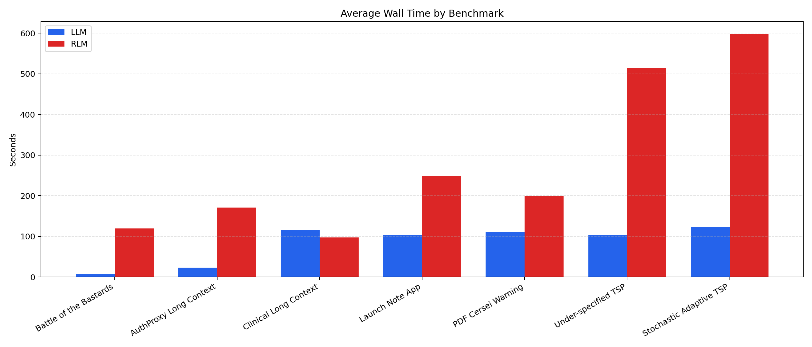

*Figure 1. Average wall time by benchmark. Blue is `LLM` and red is `RLM`. The recursive path is slower in 6 of 7 local benchmark pairs. The latency exception is `Clinical`, where `RLM` returns more quickly but does not improve accuracy.*

The latency table and figure show the same pattern from two views: the table gives exact paired averages, while the chart makes the scale of the recursive slowdown visually obvious.

This result is consistent with Pareto dominance:
recursive execution incurs higher cost without
corresponding accuracy gains.

### B Aggregate Token Profile

The token table is placed directly with the total-token chart so the numeric ratio and the visual spread can be read together.

#### Table 2B. Local Token Usage Summary

| Benchmark | LLM Avg Total | RLM Avg Total | Token Ratio |
| --- | ---: | ---: | ---: |
| Battle of Bastards | 313.000 | 10787.700 | 34.5x |
| AuthProxy | 1249.600 | 13364.200 | 10.7x |
| Clinical | 2885.500 | 11762.900 | 4.1x |
| Launch Note | 1431.100 | 12168.200 | 8.5x |
| PDF Cersei | 4864.200 | 19413.222 | 4.0x |
| TSP Missing Matrix | 1340.700 | 24015.800 | 17.9x |
| Stochastic TSP | 1433.100 | 23607.889 | 16.5x |

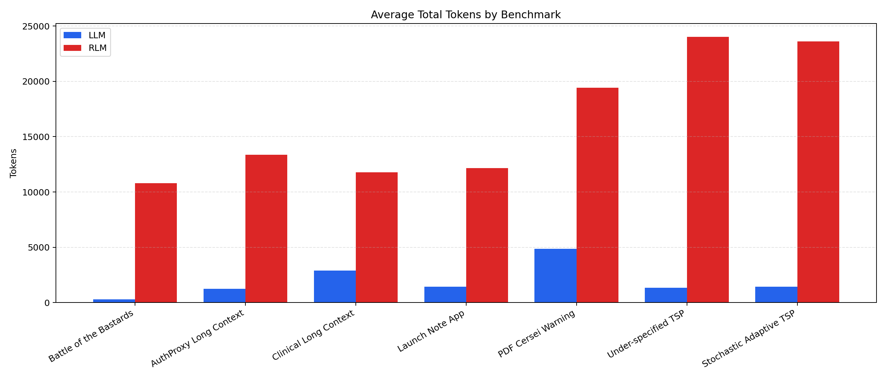

*Figure 2. Average total tokens by benchmark. `RLM` consumes substantially more tokens than `LLM` in every local benchmark family.*

This result is consistent with Pareto dominance:
recursive execution incurs higher cost without
corresponding accuracy gains.

### C Run Variability

The next two figures stay with this subsection because they explain the spread behind the paired averages reported above.

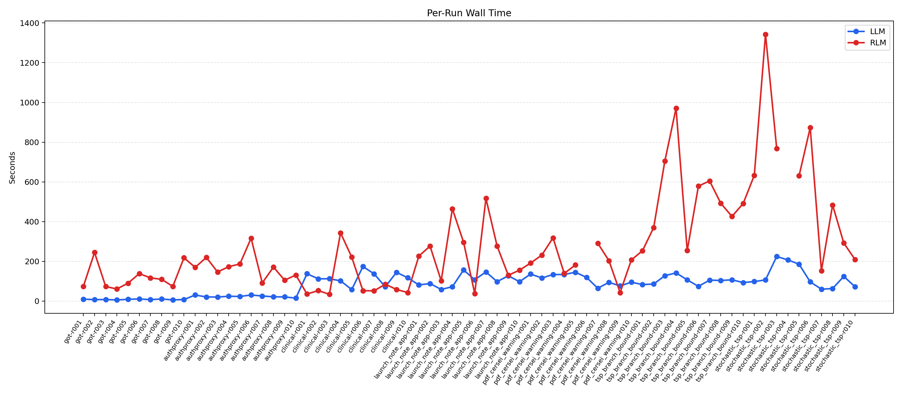

*Figure 3. Per-run wall time. Recursive execution shows large run-to-run variance on the harder tasks, especially the TSP benchmarks.*

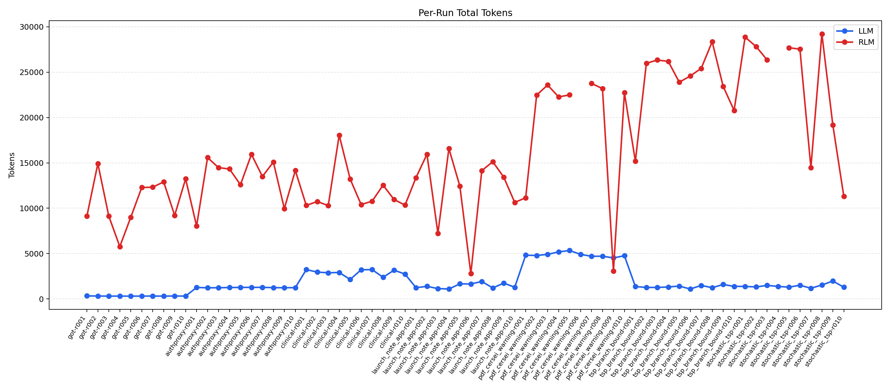

*Figure 4. Per-run token usage. Token cost remains consistently low for the direct baseline and high for the recursive path, with the single nonzero-exit recursive run appearing as a missing point.*

Taken together, the paired tables and figures reveal the central local systems trend: `RLM` is more token-intensive on every benchmark pair and slower on all but one. The lone latency exception is Clinical Long Context, where the recursive path is faster only because it collapses to a zero-accuracy answer.

This result is consistent with Pareto dominance:
recursive execution incurs higher cost without
corresponding accuracy gains.

## VI ACCURACY EVALUATION

### A Accuracy Protocol

The local Ollama batch was rescored post hoc using a
deterministic benchmark-specific rubric. The goal was to
measure answer correctness rather than formatting
polish. Each run was scored from the delivered markdown
output, not from intermediate trace content. This choice
is important for recursive runs because several `RLM`
traces contained correct intermediate reasoning followed
by malformed or irrelevant final answers. The scored unit
is therefore the user-visible output. Once the rubric
definitions were fixed, the scoring pass was executed
programmatically via `scripts/build_accuracy_report.py`
rather than by manual per-run free-form adjudication.

Runs with nonzero exit status were assigned an accuracy
of zero. This affects 2 local recursive runs: `PDF Cersei Warning` run `006` (`-9`), `Stochastic Adaptive TSP` run `004` (`-9`).
The saved markdown artifact does not contain a Python
traceback, so the paper does not claim a root cause; on
macOS this pattern is consistent with external process
termination under resource pressure, but that remains an
inference rather than a verified diagnosis.

The Launch Note checklist is also deterministic in this
implementation: it is evaluated as a presence/absence
check over ten grounded plan elements rather than as a
holistic human quality judgment.

### B Rubric Summary

#### Table 3. Accuracy Rubric Summary

| Benchmark | Scoring Rule | Range |
| --- | --- | --- |
| Battle of Bastards | Binary: Jon Snow plus decisive ally (`Sansa` or `Vale`). | 0 or 1 |
| AuthProxy | Five facts: Q1-Q3 = `7`, production-status span, failover conclusion. | 0 to 1 |
| Clinical | Five facts: Q1-Q3 = `PCN-HIGH`, renal-monitoring span, reasoning chain. | 0 to 1 |
| Launch Note | Ten-point grounded checklist over plan completeness and constraints. | 0 to 1 |
| PDF Cersei | Binary exact-quote match after whitespace normalization. | 0 or 1 |
| TSP Missing Matrix | Binary grounded refusal because the distance matrix is absent. | 0 or 1 |
| Stochastic TSP | `0.5` correct cost, `0.25` per correct initial action branch. | 0 to 1 |

### C Aggregate Accuracy

#### Table 4. Local Accuracy Summary

| Benchmark | LLM Mean | RLM Mean | Accuracy Gap | Better Path |
| --- | ---: | ---: | ---: | --- |
| Battle of Bastards | 1.000 | 0.800 | 0.200 | LLM |
| AuthProxy | 1.000 | 0.420 | 0.580 | LLM |
| Clinical | 0.900 | 0.180 | 0.720 | LLM |
| Launch Note | 0.880 | 0.210 | 0.670 | LLM |
| PDF Cersei | 0.000 | 0.000 | 0.000 | Tie |
| TSP Missing Matrix | 0.100 | 0.100 | 0.000 | Tie |
| Stochastic TSP | 0.250 | 0.000 | 0.250 | LLM |

Across all 70 local runs per mode, the deterministic post-hoc rubric yields a mean accuracy of `0.590` for `LLM` and `0.244` for `RLM`.

#### Table 5. Aggregate Accuracy With and Without Capability-Floor Tasks

| Setting | LLM Mean | RLM Mean | Gap |
| --- | ---: | ---: | ---: |
| All seven benchmarks | 0.590 | 0.244 | 0.346 |
| Excluding zero-zero capability-floor benchmarks | 0.688 | 0.285 | 0.403 |

Excluding the one zero-zero capability-floor benchmark does not erase the local gap; it widens it. On the remaining discriminative tasks, mean run-level accuracy rises from `0.590` to `0.688` for `LLM` and from `0.244` to `0.285` for `RLM`.

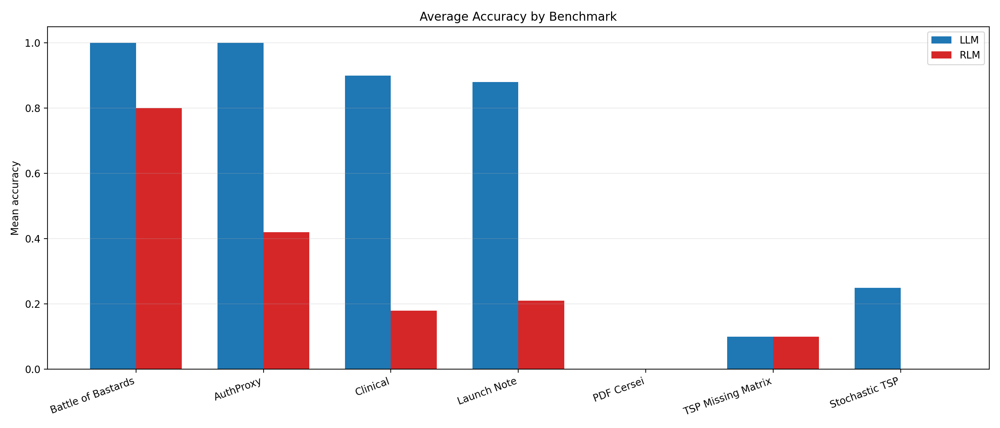

*Figure 5. Average accuracy by benchmark for the controlled local Ollama batch. Direct prompting outperformed recursive execution on every benchmark-family mean, with the largest gaps appearing on AuthProxy retrieval, Clinical Long Context, and Launch Note App.*

### D Per-Run Accuracy

The per-run view sits with the aggregate table above because it shows whether the averages come from stable behavior or from a mix of clean hits and zero-score failures.

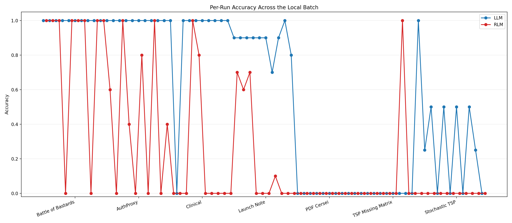

*Figure 6. Per-run accuracy across the local batch. `LLM` is notably more stable on retrieval and planning tasks, while `RLM` exhibits several zero-score runs caused by malformed finals, irrelevant answers, or failure to complete the requested extraction.*

### E Interpretation

The accuracy audit changes the interpretation of the
local batch materially. The systems section showed that
`RLM` is more token-intensive on every local benchmark
pair and slower on all but one. The single latency
exception, Clinical Long Context, is not a recursive win:
the recursive path returns faster only because it
collapses to zero accuracy. The scored results therefore
show that, under this model and runtime, recursion
failed to buy higher answer quality. On the controlled
local batch, `LLM` outperformed `RLM` on five
benchmark-family means and tied on the two remaining
floor-style tasks.

Two cases are especially revealing. First, the
under-specified TSP benchmark was designed as a
grounding test: the correct behavior is to refuse because
the distance matrix is missing. In the completed local
batch, neither path delivered a clean grounded refusal in
its final answer, which means the benchmark exposed a
shared failure mode of the local model rather than a
recursive advantage. Second, the PDF warning benchmark
produced zero exact-quote matches on both paths,
indicating that local `qwen2.5:7b` was not reliable for
that retrieval setup even before recursion was
introduced. These zero-score tasks are still worth
keeping, but they represent different diagnostic floor
cases. The PDF benchmark is an exact-retrieval failure:
the local model did not recover the requested quote even
when the answer was present in context. The
under-specified TSP is a grounding failure: neither path
recognized that the prompt omitted the distance matrix
and therefore should have triggered a refusal. Together
they expose capability-floor regimes in which execution
strategy cannot rescue the base model, while still
preserving distinct failure surfaces instead of silently
removing the hardest benchmarks from the suite.

The strongest local baseline performance appears on the
fact-retrieval and planning tasks. `LLM` scored perfectly
on Battle of the Bastards and AuthProxy, reached `0.900`
mean accuracy on Launch Note App, and substantially
outperformed `RLM` on Clinical Long Context. Across
all non-floor benchmarks, recursive execution is
strictly dominated: it increases cost while failing to
improve accuracy. RLM failures were frequently
associated with malformed final outputs despite correct
intermediate reasoning.

The stochastic adaptive TSP benchmark should be read
more cautiously than the retrieval tasks. Under the
current rubric, partial credit can be earned by naming the
correct initial branches even when the exact expected
cost is wrong. In the local batch, the direct baseline's
mean of `0.250` is therefore only weak evidence of real
policy reasoning and is consistent with a near-floor
regime in which branch labels may be recovered without
deriving the full adaptive solution.

This result is consistent with Pareto dominance:
recursive execution incurs higher cost without
corresponding accuracy gains.

### F Local RLM Failure Taxonomy

A heuristic scan of the saved local `RLM` finals identifies `58` sub-perfect runs. The point is not to claim a complete mechanistic decomposition, but to distinguish formatting/finalization failures from benchmark-level reasoning misses.

#### Table 6B. Heuristic Failure Taxonomy for Sub-Perfect Local RLM Runs

| Category | Count | Share |
| --- | ---: | ---: |
| Meta/finalization artifact | 20 | 34.5% |
| Non-refusal on under-specified TSP | 9 | 15.5% |
| Benchmark-specific semantic miss | 27 | 46.6% |
| Nonzero exit | 2 | 3.4% |

The dominant local recursive failure mode is finalization drift: placeholder text, code fragments, or tool-oriented meta output leaking into the final answer instead of a clean user-facing response.

### G Cost-Accuracy Frontier

To avoid forcing the reader to mentally merge separate latency, token, and accuracy tables, Table 6A gives a cost-normalized efficiency view and Table 7 with Figures 7–8 collapse those dimensions into a single local frontier view. The intervals are descriptive 95% confidence intervals computed from the saved runs using Student-`t` half-widths; they quantify instability but do not constitute a high-power significance study.

#### Table 6A. Local Cost-Normalized Accuracy

| Benchmark | LLM Acc/1k Tok | RLM Acc/1k Tok | LLM Acc/s | RLM Acc/s |
| --- | ---: | ---: | ---: | ---: |
| Battle of Bastards | 3.195 | 0.074 | 0.12381 | 0.00668 |
| AuthProxy | 0.800 | 0.031 | 0.04322 | 0.00246 |
| Clinical | 0.312 | 0.015 | 0.00772 | 0.00184 |
| Launch Note | 0.615 | 0.017 | 0.00852 | 0.00085 |
| PDF Cersei | 0.000 | 0.000 | 0.00000 | 0.00000 |
| TSP Missing Matrix | 0.075 | 0.004 | 0.00097 | 0.00019 |
| Stochastic TSP | 0.174 | 0.000 | 0.00202 | 0.00000 |

In cost-normalized terms, the local result is the same: on every non-floor benchmark family, direct prompting delivers more scored accuracy per 1,000 tokens and more scored accuracy per second than the recursive path.

#### Table 7. Local Cost-Accuracy Frontier With 95% CI

| Benchmark | Mode | Runs | Wall Time ± CI | Total Tokens ± CI | Accuracy ± CI |
| --- | --- | ---: | ---: | ---: | ---: |
| Battle of Bastards | LLM | 10 | 8.077 ± 1.558 | 313.000 ± 6.647 | 1.000 ± 0.000 |
| Battle of Bastards | RLM | 10 | 119.765 ± 55.812 | 10787.700 ± 2422.113 | 0.800 ± 0.370 |
| AuthProxy | LLM | 10 | 23.135 ± 4.210 | 1249.600 ± 15.986 | 1.000 ± 0.000 |
| AuthProxy | RLM | 10 | 171.029 ± 55.990 | 13364.200 ± 2227.426 | 0.420 ± 0.365 |
| Clinical | LLM | 10 | 116.577 ± 30.208 | 2885.500 ± 326.397 | 0.900 ± 0.278 |
| Clinical | RLM | 10 | 97.614 ± 89.934 | 11762.900 ± 2134.612 | 0.180 ± 0.336 |
| Launch Note | LLM | 10 | 103.273 ± 27.848 | 1431.100 ± 253.734 | 0.880 ± 0.069 |
| Launch Note | RLM | 10 | 248.228 ± 134.578 | 12168.200 ± 3751.415 | 0.210 ± 0.279 |
| PDF Cersei | LLM | 10 | 111.305 ± 24.156 | 4864.200 ± 210.124 | 0.000 ± 0.000 |
| PDF Cersei | RLM | 9 | 200.657 ± 74.770 | 19413.222 ± 6740.725 | 0.000 ± 0.000 |
| TSP Missing Matrix | LLM | 10 | 102.791 ± 18.047 | 1340.700 ± 123.254 | 0.100 ± 0.278 |
| TSP Missing Matrix | RLM | 10 | 514.593 ± 190.262 | 24015.800 ± 3259.514 | 0.100 ± 0.278 |
| Stochastic TSP | LLM | 10 | 123.732 ± 53.172 | 1433.100 ± 193.255 | 0.250 ± 0.207 |
| Stochastic TSP | RLM | 9 | 598.444 ± 345.909 | 23607.889 ± 6304.742 | 0.000 ± 0.000 |

If recursive execution were beneficial, its points would lie above or to the left of the baseline. Instead, in this ten-run local batch the recursive points never rise above the matched baseline in accuracy. On six task families they also move rightward on latency; the lone leftward move occurs on Clinical, where `RLM` is faster only because it collapses to zero accuracy while still consuming more tokens.

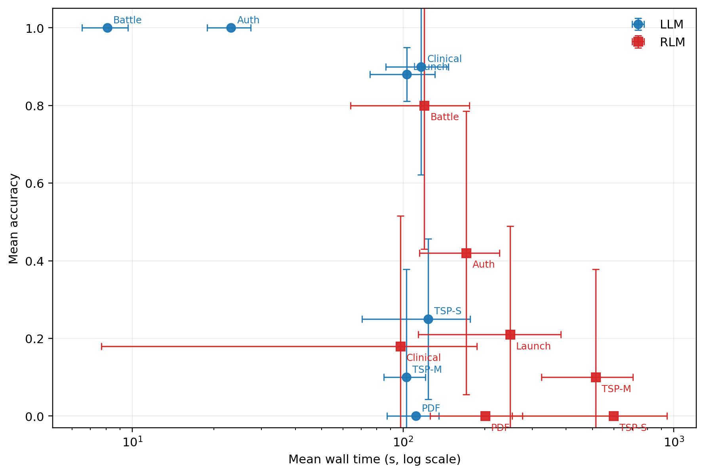

*Figure 7. Local cost-accuracy frontier using mean wall time on the x-axis and mean accuracy on the y-axis. Blue denotes `LLM`, red denotes `RLM`, and the error bars show descriptive 95% confidence intervals. The recursive points deliver no accuracy gain on any benchmark family; the lone latency exception is Clinical, where the lower wall time corresponds to zero accuracy.*

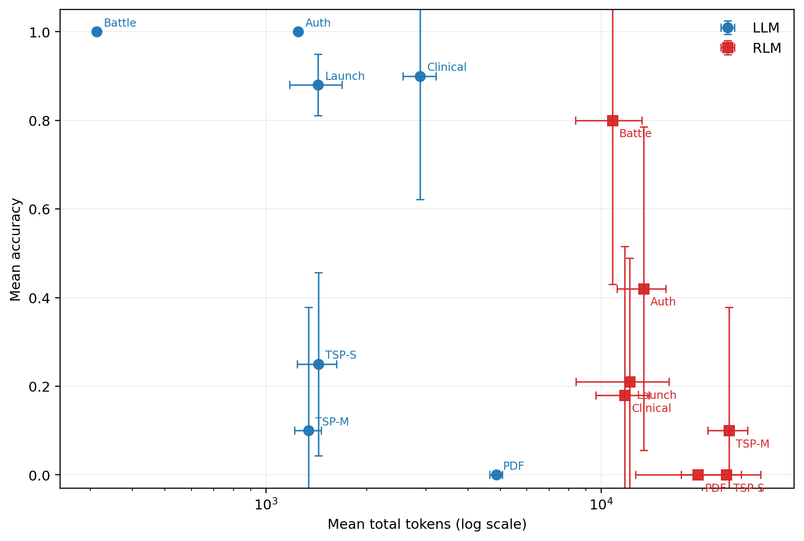

*Figure 8. Local cost-accuracy frontier using mean total tokens on the x-axis and mean accuracy on the y-axis. The same down-and-right pattern appears: recursive execution costs more and does not deliver a local accuracy gain on any benchmark family.*

This frontier view makes the main local result visually
immediate. If recursive execution were beneficial in
this local setting, its points would lie above or to the
left of the direct baseline. Instead, across the pooled
local batch, the recursive points lie strictly to the
right and below: more expensive on tokens, usually more
expensive on latency, and never better on
benchmark-family accuracy.

The confidence intervals are descriptive rather than definitive, but they still strengthen the result. In the clearest local gaps, especially AuthProxy and Launch Note App, the accuracy intervals do not overlap while the cost intervals remain widely separated. The natural interpretation is not that recursion is universally useless, but that its theoretical advantages in decomposition and verification are not realized under this weaker local model.

## VII CROSS-TASK FINDINGS

Several patterns hold across the local benchmark.

First, direct prompting is more token-efficient on every
task. Second, direct prompting is more latency-efficient
on `6` of `7` task families. The sole
latency exception is Clinical Long Context, where the
recursive path returns faster only because it fails
quickly and scores zero on the downstream extraction
rubric. Third, the recursive penalty is strongest on the
TSP-style reasoning tasks, where token and latency costs
scale sharply with deeper traces.

These patterns are reported at the benchmark-family mean
level of a ten-run local batch, not as a high-power
significance study. Several `RLM` intervals are wide,
especially on AuthProxy, Launch Note, and the TSP
benchmarks, so the paper’s strongest claim is
consistency of direction rather than precise effect-size
estimation.

Across benchmarks, recursive execution follows a
consistent three-phase failure pattern: (1) token
expansion from repeated decomposition and context
accumulation, (2) latency amplification from sequential
dependency between recursive calls, and (3) absence of
accuracy gains, with occasional degradation. This
pattern shows that recursive structure compounds cost
without delivering corresponding benefits in constrained
environments.

### A Token Burst Instability

Recursive execution changes the shape of cost, not
just its mean. A direct `LLM` call is a single bounded
request whose latency and token use are largely fixed at
invocation time. A recursive runtime transforms one
user query into a sequence of dependent backend calls,
each of which may repeat wrapper context, serialize
intermediate state, expand prior traces, and trigger
further subcalls. The resulting token profile is bursty
rather than smooth. We refer to this systems phenomenon
as **token burst instability**. We introduce token burst
instability as a systems-level evaluation lens for
recursive execution, in which variance in token usage
rather than average token cost determines deployment
viability under real-world constraints.

Token burst instability matters because deployment
constraints are often enforced against bursts, not
averages. Provider quotas such as tokens-per-day, local
serving memory pressure, and wall-clock tail latency
all respond to peaks in demand rather than to the mean
token count reported after the fact. A recursive
execution path can therefore look acceptable under
average token accounting while still being
operationally fragile: one hard run may exhaust the
remaining provider budget, stall the local runtime, or
terminate before a usable final answer is produced.

This suggests that the primary bottleneck in recursive
systems is not reasoning capability, but execution
structure under resource constraints.

### B Mechanistic Interpretation

Recursive execution introduces a systems tax. Each extra
loop, code execution step, tool interaction, trace
serialization, and finalization stage adds latency,
token cost, and additional opportunities for failure.
On a local model served through Ollama, those costs are
directly visible as wall-clock delay, higher resource
pressure, and broader output instability.

Under a small local model, that added structure does not
convert into better final answers across these benchmark
families. Instead, it
often amplifies error by giving a weak model more
opportunities to drift, over-generate, or fail during
finalization. These results support a model-strength
threshold for effective recursion. Below this threshold,
recursive execution amplifies error and increases system
cost; above it, selective gains can emerge, as shown in
the Gemini archival contrast. Token burst instability is
one mechanism through which that systems tax becomes
visible in practice.

### C Operational Interpretation

For local deployment, the benchmark suggests a simple
default rule:

- use plain `LLM` execution when the task is a direct
  retrieval, extraction, or planning workload
- reserve `RLM` for situations where iterative checking,
  explicit traceability, or decomposition is operationally
  necessary

While recursive methods may provide benefits under
stronger models or specialized workflows, we show that
under realistic constraints they are systematically
dominated in cost, latency, and stability. The tied local
accuracy cases (`PDF Cersei`, `TSP Missing Matrix`)
should be read as capability-floor regimes rather than as
evidence of a recursive quality gain. More broadly, the
local batch supports a model-strength threshold for
useful recursion: stronger backends may sometimes use
decomposition and checking productively, whereas weaker
local models tend to amplify existing errors rather than
correct them.

Clinical Long Context exposes an important evaluation
pitfall. There, the recursive path appears faster, but
the apparent efficiency gain is produced by premature
termination and degraded reasoning quality rather than
by better execution. Lower runtime is therefore not, by
itself, evidence of better system behavior when accuracy
collapses.

In this setting, recursive execution is not merely
inefficient—it is Pareto-dominated.

Across all benchmark families, recursive execution is
Pareto-dominated by direct inference, incurring higher
cost while delivering no accuracy improvement.

### D Same-Family Local Scale Probe (`qwen2.5:14b`)

To test whether the local 7B result was merely a
small-model artifact, we ran a same-family local scale
probe on `qwen2.5:14b` under the same Ollama endpoint,
paired harness, and scoring procedure. The first five
benchmark families were rerun for five paired
repetitions each. The two heaviest TSP families were
capped at three paired repetitions because the larger
local recursive runs became substantially slower and
repeatedly stalled under local resource pressure. This
probe is therefore descriptive and is not pooled with
the ten-run 7B frontier.

#### Table 7A. Same-Family Local Scale Probe on `qwen2.5:14b`

| Benchmark | Runs | LLM Mean Acc | RLM Mean Acc | LLM Avg Wall (s) | RLM Avg Wall (s) | LLM Avg Total Tok | RLM Avg Total Tok |
| --- | ---: | ---: | ---: | ---: | ---: | ---: | ---: |
| Battle of Bastards | 5 | 1.000 | 0.000 | 13.901 | 146.912 | 315.600 | 5967.000 |
| AuthProxy | 5 | 1.000 | 0.480 | 38.789 | 774.420 | 1180.600 | 21362.800 |
| Clinical | 5 | 0.800 | 0.187 | 395.399 | 272.922 | 3254.500 | 8729.400 |
| Launch Note | 5 | 0.860 | 0.180 | 113.549 | 534.902 | 1004.000 | 8530.800 |
| PDF Cersei | 5 | 0.000 | 0.000 | 220.538 | 829.102 | 4596.250 | 20262.400 |
| TSP Missing Matrix | 3 | 0.000 | 0.000 | 197.598 | 1771.919 | 1071.500 | 23751.000 |
| Stochastic TSP | 3 | 0.000 | 0.000 | - | - | - | - |

The scale probe does not reverse the local conclusion.
Direct `14B` remained strong on Battle of the Bastards
and AuthProxy (`1.000` mean accuracy on both) and
remained clearly better on Launch Note (`0.860` versus
`0.180`). Recursive accuracy improved only marginally
on AuthProxy (`0.420` at 7B to `0.480` at 14B) and was
essentially flat on Clinical (`0.180` to `0.187`), but
those small changes came with much larger runtime
penalties. On AuthProxy, for example, `RLM` rose from
`171.029s` and `13364.200` tokens at 7B to `774.420s`
and `21362.800` tokens at 14B.

The hardest local tasks remained unsolved at larger
scale. The under-specified TSP mean was `0.000` for
both 14B paths in the capped three-run probe, and the
stochastic adaptive TSP produced no successful 14B
completions in either mode. Across the available `31`
probe runs per mode, weighted mean accuracy was
`0.590` for direct `LLM` and `0.137` for `RLM`. Because
the TSP families used reduced run counts, that summary
should be treated as descriptive rather than as a
co-equal statistical comparison with the primary 7B
batch. The same-family operational reading is still
clear: increasing local model size increased runtime
sharply, but did not convert recursive control flow into
a better answer-generation regime on these benchmarks.

The 14B probe demonstrates that the observed
inefficiencies are not artifacts of small models, but
persist even as model capacity increases.

This result is consistent with Pareto dominance:
recursive execution incurs higher cost without
corresponding accuracy gains.

Having established the controlled local result, the next
question is whether hosted deployment conditions alter
the operational picture. The hosted sections therefore
serve two different purposes. Groq is a fresh
quota-constrained stress test with uniform run counts
but provider-side budget failures. Gemini remains a
lighter archival supplement whose value is primarily to
preserve a counterexample where recursion helped on a
stronger backend.

## VIII HOSTED BACKEND STRESS TESTS

### A Quota-Constrained Deployment Analysis (Groq)

The hosted Groq batch was run with
`llama-3.3-70b-versatile` for five paired runs per task.
This section evaluates execution strategies under
real-world quota constraints rather than idealized
conditions. All 70 hosted runs were launched and
logged. The resulting failures are not a secondary
artifact of the benchmark; they expose a deployment
failure mode of recursive execution under provider-side
quota regimes.

The Groq logs distinguish between a temporary
rate-limit encounter and a fatal rate-limit failure. Some
runs printed a cooldown message, retried, and then
completed; those runs are retained as usable. A row is
counted as fatal only when provider-side quota or
request failure terminates the run without a usable final
answer. This distinction matters because recursive
execution amplifies not only mean token use but token
variance: a difficult recursive run can create a burst of
multiple backend calls with repeated wrapper prompts,
trace serialization, and accumulated context, making it
much more likely to exhaust quota mid-execution. In
the terminology used throughout this paper, Groq makes
token burst instability directly observable as a
provider-side failure mode.

Recursive execution is implemented as multiple
dependent calls rather than a single bounded request.
That changes the relevant quantity from average token
cost to token burst distribution. Provider quotas such
as tokens-per-day are enforced against those bursts, not
against a smoothed mean. A recursive run can therefore
remain acceptable in average token terms while still
failing because one execution burst crosses the remaining
quota boundary. Thus, recursive execution introduces
variance-driven failure modes that are invisible in
average-case token analysis. This is precisely the
deployment signature of token burst instability.

Under Groq, the quota failures are therefore not merely
correlated with token burst instability; they are its
direct operational consequence.

Table 8 summarizes the core deployment failure
pattern.

#### Table 8. Groq Fatal Failure Summary Under Provider Quotas

| Task | LLM Fatal Runs | RLM Fatal Runs | Observations |
| --- | ---: | ---: | --- |
| Battle of Bastards | 0 | 0 | All runs remained usable under Groq quotas. |
| AuthProxy Long Context | 0 | 0 | All runs remained usable; one recursive run exited nonzero but did not fail fatally on quota. |
| Clinical Long Context | 0 | 0 | Runs remained usable after retries; no fatal quota rows remained. |
| Launch Note App | 0 | 0 | Usable after retries; no fatal quota rows remained in the final summary. |
| PDF Cersei Warning | 0 | 1 | Direct runs showed prompt-size or request-shape failures but no fatal quota loss; recursion added one fatal quota failure. |
| TSP Missing Matrix | 3 | 5 | Failure-heavy under Groq quotas; recursive execution exhausted provider budget more often than the direct baseline. |
| Stochastic TSP | 5 | 5 | Both modes failed under quota constraints on every run; recursion did not improve completion robustness. |

In aggregate, `8` direct rows and `11` recursive rows
remained fatally unsuccessful after retries. The quota
problem is therefore not unique to recursion, but the
recursive path is measurably more fragile under the
same hosted budget regime.

The pattern is asymmetric: recursive execution fails
earlier and more often under identical quota
constraints.

The easier hosted tasks (`Battle of Bastards`,
`AuthProxy`, `Clinical`, and `Launch Note App`) mostly
remained usable, sometimes after retries. The harder
tasks exposed the deeper systems issue. `PDF Cersei`
already stresses the provider through long input size,
but the most decisive pattern appears on the TSP-style
tasks. On `TSP Missing Matrix`, the direct baseline
still completed two runs that the recursive path did
not. On `Stochastic TSP`, both modes ultimately failed
under quota pressure, but recursive execution offered no
stability advantage and still consumed the larger token
bursts.

This is a systems result, not a logging accident. Flat
`LLM` calls are more stable under provider limits
because their token footprint is bounded by a single
request. Recursive execution transforms one user prompt
into a burst pattern whose size depends on the number of
iterations, subcalls, and trace growth. Under
tokens-per-day quotas, that burstiness matters as much
as average token cost. A runtime can therefore fail as a
deployment before it fails as a reasoning method. In
quota-constrained hosted settings, practical efficiency
depends not only on answer quality, but on whether the
execution strategy fits inside the provider’s budget
envelope.

The hosted Groq rows are therefore meaningful even
though some are incomplete. They should not be read as
a clean accuracy benchmark, because provider quotas
terminate a subset of runs before final evaluation. They
should be read as direct evidence that recursive
execution is more deployment-fragile under real hosted
limits. That observation complements, rather than
duplicates, the local Ollama result: the local batch
shows the cost-accuracy tax directly, while Groq shows
that the same tax can become a hard operational failure
mode under provider quotas.

In quota-constrained environments, recursive execution
is not only more expensive but less reliable as a
system.

This result is consistent with Pareto dominance:
recursive execution incurs higher cost without
corresponding accuracy gains.

### B Gemini Archival Observations

The Gemini archive is retained only as qualitative
evidence of backend dependence. Unlike the Groq stress
test, it is not a fresh matched batch. The archived
artifacts were recovered from earlier benchmark
branches, deduplicated, and normalized under
`benchmark_runs/20260409-gemini-archival-artifacts/`.
Run counts vary by task and one Battle of the Bastards
recursive artifact preserved wall time but not token
counts. For that reason, Gemini is not pooled with the
controlled local accuracy analysis and is not used as a
second formal benchmark.

Its value is narrower but still useful: it preserves the
paper’s clearest hosted counterexample to the local
null result. On the under-specified TSP benchmark, the
preserved benchmark summary labels the direct baseline
as a failure and the recursive path as correct. The
normalized archival rows show the recursive path
averaging `15.488s` versus `75.014s` for the baseline
while remaining token-heavier (`20,045` versus `4,713`
total tokens). The practical lesson is not that
recursion wins outright, but that stronger hosted
backends can sometimes convert the recursive path into
the better-performing benchmark response on
under-specified prompts.

#### Table 9. Gemini Archival Qualitative Findings

| Benchmark | Archival signal | Favored path |
| --- | --- | --- |
| Battle of Bastards | Preserved baseline finals were correct; recursive artifact is too partial to trust. | `LLM` |
| AuthProxy | Baseline preserved all answers cleanly; recursive finals often broke format. | `LLM` |
| Clinical / Launch Note / PDF / Stochastic | Archive too sparse or too inconsistent for a strong correctness ranking. | Tie / unclear |
| TSP Missing Matrix | Recursive path produced the correct benchmark response; baseline often hallucinated tours. | `RLM` |

Taken together, the hosted evidence splits into two
complementary observations. Groq shows that recursive
execution can become quota-fragile under real provider
budgets. Gemini preserves an existence proof that a
stronger hosted backend can still turn the recursive
path into the better benchmark response on some
grounding-sensitive prompts. The hosted sections
therefore do not overturn the local result; they refine
it by showing that backend constraints and backend
strength matter in different ways.

## IX LIMITATIONS

This paper has several limitations.

1. The strongest local evidence is still the ten-run 7B
   batch. The 14B local experiment is a same-family
   scale probe with mixed counts (`5` runs on the first
   five tasks and `3` on the two heaviest TSP tasks), so
   it extends the paper’s scope but is not a co-equal
   second controlled batch.
2. The hosted Groq section is a quota-constrained
   stress test rather than a clean second accuracy
   benchmark. All rows were executed and logged, but a
   subset terminates in fatal provider-side quota
   failures, so the section is most informative as
   deployment evidence rather than as a matched
   accuracy replication.
3. The Gemini hosted section is archival rather than a
   fresh rerun, so its run counts and instrumentation are
   uneven.
4. The accuracy audit is script-applied and deterministic
   once the rubric is fixed, but the rubric itself remains
   author-defined and was not validated by a second
   scorer with agreement statistics. This makes the
   current accuracy layer useful but not fully validated.
5. The local evidence still uses modest repeated-run
   counts: `10` paired runs per task in the primary 7B
   batch and `5/3` paired runs in the 14B probe.
6. Exact Ollama serving metadata such as version,
   quantization tag, and effective context window were
   not captured by the original harness, and the run logs
   record wall-clock time rather than hardware-isolated
   kernel time.
7. Provider sampling defaults were used because the
   harness did not override temperature or top-`p`, so a
   portion of run-to-run variance may reflect default
   sampling stochasticity rather than execution strategy
   alone.
8. The comparison is intentionally not prompt-equated.
   The direct baseline is a production-style single call,
   while `RLM` is measured with its full wrapper prompt
   and runtime controller because the paper evaluates
   deployed systems rather than isolated prompting
   primitives.
9. No intermediate strong baselines were run. This is a
   deliberate scope decision: the paper does not compare
   reasoning techniques such as chain-of-thought,
   self-consistency, or tool use without recursion, but
   instead measures what happens when a direct `LLM`
   call is replaced by a recursive runtime. Future work
   should test whether simpler structured prompting
   strategies can recover some benefits of structured
   reasoning without incurring the full systems overhead
   of recursive execution.
10. 2 recursive runs: `PDF Cersei Warning` run `006` (`-9`), `Stochastic Adaptive TSP` run `004` (`-9`).

These constraints mean the present manuscript should be
read as a controlled 7B local benchmark, a smaller
same-family 14B local scale probe, a hosted
quota-constrained Groq stress test, and an archival
Gemini comparison, not as a final general statement
about all `LLM` versus `RLM` deployments.

## X CONCLUSION

This paper evaluates recursive execution as a deployed
system, not as a reasoning primitive in isolation. Under
the pooled ten-run local Ollama batch with `qwen2.5:7b`,
replacing a direct model call with the recursive runtime
produced a Pareto-dominated cost-accuracy
profile: higher token cost on every benchmark family,
higher latency on six of seven, and no benchmark-family
accuracy gain under the task-specific rubric. Across the
70 local runs per mode, mean accuracy was `0.590` for
`LLM` and `0.244` for `RLM`.

In the language of multi-objective evaluation, recursive
execution is Pareto-dominated in this local setting.

Within this ten-run `qwen2.5:7b` batch, the observed
recursive frontier is Pareto-dominated relative to the
direct baseline: higher token cost everywhere, no task-
family accuracy gain anywhere in the benchmark, and
only one latency exception. That exception is Clinical
Long Context, where `RLM` returns faster only because
it collapses to zero accuracy rather than solving the
extraction task. On the two floor-style benchmarks, the
local means are tied, but nowhere does `RLM`
outperform the direct baseline. The strongest conclusion
is therefore scoped but clear. For this model, this
runtime, and this serving stack, recursive execution
does not justify its systems tax on the tested
workloads.
Recursive execution is not a free improvement; it is a
trade-off that must be justified at the system level.

The same-family `qwen2.5:14b` scale probe leaves that
core result unchanged. Direct prompting remained
stronger on every non-floor 14B benchmark-family mean,
while recursive execution became substantially slower on
the long-context and TSP tasks without recovering a
local accuracy advantage. The larger model therefore
does not rescue recursive execution under this serving
stack; it mainly increases the operational cost of the
recursive path.

The hosted Groq stress test adds a second systems
lesson. Recursive token amplification increases quota
fragility. Several hosted recursive runs exhausted
provider tokens-per-day budget within a single
benchmark run, whereas matched direct calls more often
completed under the same quota regime. On the hardest
hosted tasks, both paths eventually failed, but the
recursive path failed earlier and more frequently. This
means practical efficiency must be judged not only by
latency and accuracy, but also by whether the execution
strategy fits inside real provider quotas. In hosted
settings, token burst instability makes recursive
execution less reliable even before answer quality is
considered.

The Gemini archival section broadens the systems view,
but it does not overturn the local or Groq result. Its
value is narrower: it preserves the paper’s clearest
counterexample, namely the under-specified TSP case
where a stronger hosted backend did convert the
recursive path into the better benchmark response while
the direct baseline hallucinated missing structure.
Taken together, the evidence suggests that recursive
execution is not a free quality upgrade. Its value
depends heavily on the underlying model, the serving
backend, the provider quota regime, and whether the task
truly benefits from iterative verification rather than
from a direct grounded answer. Under weaker local
models, recursion can amplify error rather than
correcting it; under quota-constrained hosted settings,
it can also fail as a system before it fails as a
reasoning method; under stronger backends, selective
gains can emerge, but they still have to earn their
operational cost.

The results therefore highlight a gap between the
theoretical reasoning benefits of recursive decomposition
and its practical deployment costs.

Recursive execution does not fail because it is
theoretically flawed, but because its systems costs
scale faster than its reasoning benefits under realistic
constraints.
In this regime, recursive execution is not merely
inefficient—it is Pareto-dominated.

## XI FUTURE SCOPE

Several immediate extensions would strengthen this
benchmark.

1. **Inter-rater validation.** The current accuracy layer
   should be extended with a second scorer and agreement
   statistics such as Cohen's kappa so that the
   benchmark-specific rubric is not solely author-
   defined.
2. **Fully matched local scaling.** The current 14B probe
   should be extended to a fully matched second local
   batch with the same run count on every task, and then
   repeated on at least one additional model family to
   separate model-scale effects from family-specific
   behavior.
3. **Matched hosted reruns.** A fresh Gemini or other
   hosted rerun with the same logging harness would make
   the cross-backend comparison cleaner than the current
   archival reconstruction.
4. **Accuracy-cost frontier analysis.** With confidence
   intervals and larger run counts, the benchmark could
   directly analyze whether any quality gains justify the
   recursive systems tax on specific task families.
5. **Prompt and baseline ablations.** A stronger revision should compare the current recursive runtime against chain-of-thought, self-consistency, and tool use without recursive control flow, and should also test a prompt-equated baseline using the same wrapper text where possible.
6. **Failure taxonomy for recursive traces.** The
   preserved `RLM` logs enable a deeper study of where
   recursion fails: formatting drift, irrelevant finalization,
   loop behavior, sub-call misuse, or simple model
   weakness.
7. **Quota-aware recursive scheduling.** Hosted results
   suggest a practical next step: recursive runtimes
   should estimate remaining provider budget and adapt
   trace depth, subcall count, or task routing before a
   run crosses a quota boundary.

## Appendix A. Full Local Run Tables

These tables reproduce every run from the controlled local Ollama batch used in the main paper.

### A1. Battle of the Bastards

| Run | Mode | Exit | Wall (s) | Input | Output | Total |
| --- | --- | ---: | ---: | ---: | ---: | ---: |
| 001 | LLM | 0 | 9.832 | 275 | 56 | 331 |
| 001 | RLM | 0 | 73.517 | 8816 | 299 | 9115 |
| 002 | LLM | 0 | 7.135 | 275 | 41 | 316 |
| 002 | RLM | 0 | 244.427 | 13982 | 936 | 14918 |
| 003 | LLM | 0 | 7.756 | 275 | 33 | 308 |
| 003 | RLM | 0 | 73.046 | 8753 | 367 | 9120 |
| 004 | LLM | 0 | 5.573 | 275 | 33 | 308 |
| 004 | RLM | 0 | 60.789 | 5483 | 289 | 5772 |
| 005 | LLM | 0 | 8.717 | 275 | 30 | 305 |
| 005 | RLM | 0 | 90.114 | 8691 | 309 | 9000 |
| 006 | LLM | 0 | 10.512 | 275 | 36 | 311 |
| 006 | RLM | 0 | 138.139 | 11828 | 455 | 12283 |
| 007 | LLM | 0 | 7.247 | 275 | 38 | 313 |
| 007 | RLM | 0 | 116.849 | 11914 | 407 | 12321 |
| 008 | LLM | 0 | 10.503 | 275 | 33 | 308 |
| 008 | RLM | 0 | 109.263 | 12387 | 515 | 12902 |
| 009 | LLM | 0 | 5.864 | 275 | 44 | 319 |
| 009 | RLM | 0 | 73.804 | 8762 | 450 | 9212 |
| 010 | LLM | 0 | 7.631 | 275 | 36 | 311 |
| 010 | RLM | 0 | 217.703 | 12198 | 1036 | 13234 |

### A2. AuthProxy Long Context

| Run | Mode | Exit | Wall (s) | Input | Output | Total |
| --- | --- | ---: | ---: | ---: | ---: | ---: |
| 001 | LLM | 0 | 30.373 | 1082 | 178 | 1260 |
| 001 | RLM | 0 | 169.596 | 6619 | 1414 | 8033 |
| 002 | LLM | 0 | 20.656 | 1082 | 145 | 1227 |
| 002 | RLM | 0 | 219.642 | 13844 | 1741 | 15585 |
| 003 | LLM | 0 | 20.201 | 1082 | 149 | 1231 |
| 003 | RLM | 0 | 146.474 | 13488 | 990 | 14478 |
| 004 | LLM | 0 | 24.106 | 1082 | 171 | 1253 |
| 004 | RLM | 0 | 173.042 | 13385 | 937 | 14322 |
| 005 | LLM | 0 | 23.109 | 1082 | 187 | 1269 |
| 005 | RLM | 0 | 186.782 | 11409 | 1176 | 12585 |
| 006 | LLM | 0 | 30.426 | 1082 | 190 | 1272 |
| 006 | RLM | 0 | 316.270 | 14016 | 1921 | 15937 |
| 007 | LLM | 0 | 25.545 | 1082 | 192 | 1274 |
| 007 | RLM | 0 | 91.398 | 13373 | 129 | 13502 |
| 008 | LLM | 0 | 21.342 | 1082 | 157 | 1239 |
| 008 | RLM | 0 | 171.021 | 14000 | 1087 | 15087 |
| 009 | LLM | 0 | 20.940 | 1082 | 150 | 1232 |
| 009 | RLM | 0 | 105.034 | 9285 | 674 | 9959 |
| 010 | LLM | 0 | 14.653 | 1082 | 157 | 1239 |
| 010 | RLM | 0 | 131.030 | 13026 | 1128 | 14154 |

### A3. Clinical Long Context

| Run | Mode | Exit | Wall (s) | Input | Output | Total |
| --- | --- | ---: | ---: | ---: | ---: | ---: |
| 001 | LLM | 0 | 137.570 | 1645 | 1583 | 3228 |
| 001 | RLM | 0 | 35.334 | 10181 | 125 | 10306 |
| 002 | LLM | 0 | 111.993 | 1645 | 1312 | 2957 |
| 002 | RLM | 0 | 52.487 | 10392 | 351 | 10743 |
| 003 | LLM | 0 | 112.244 | 1645 | 1234 | 2879 |
| 003 | RLM | 0 | 34.254 | 10160 | 123 | 10283 |
| 004 | LLM | 0 | 101.873 | 1645 | 1270 | 2915 |
| 004 | RLM | 0 | 343.306 | 15177 | 2883 | 18060 |
| 005 | LLM | 0 | 57.730 | 1645 | 499 | 2144 |
| 005 | RLM | 0 | 221.131 | 11609 | 1604 | 13213 |
| 006 | LLM | 0 | 173.678 | 1645 | 1569 | 3214 |
| 006 | RLM | 0 | 52.092 | 10208 | 196 | 10404 |
| 007 | LLM | 0 | 137.055 | 1645 | 1582 | 3227 |
| 007 | RLM | 0 | 51.368 | 10459 | 314 | 10773 |
| 008 | LLM | 0 | 71.576 | 1645 | 743 | 2388 |
| 008 | RLM | 0 | 84.931 | 11884 | 661 | 12545 |
| 009 | LLM | 0 | 144.718 | 1645 | 1519 | 3164 |
| 009 | RLM | 0 | 58.383 | 10644 | 320 | 10964 |
| 010 | LLM | 0 | 117.333 | 1645 | 1094 | 2739 |
| 010 | RLM | 0 | 42.849 | 10120 | 218 | 10338 |

### A4. Launch Note App

| Run | Mode | Exit | Wall (s) | Input | Output | Total |
| --- | --- | ---: | ---: | ---: | ---: | ---: |
| 001 | LLM | 0 | 81.166 | 257 | 978 | 1235 |
| 001 | RLM | 0 | 226.218 | 11223 | 2144 | 13367 |
| 002 | LLM | 0 | 88.222 | 257 | 1129 | 1386 |
| 002 | RLM | 0 | 276.742 | 13106 | 2843 | 15949 |
| 003 | LLM | 0 | 58.346 | 257 | 879 | 1136 |
| 003 | RLM | 0 | 102.077 | 5808 | 1416 | 7224 |
| 004 | LLM | 0 | 72.258 | 257 | 837 | 1094 |
| 004 | RLM | 0 | 464.365 | 14161 | 2426 | 16587 |
| 005 | LLM | 0 | 156.415 | 257 | 1400 | 1657 |
| 005 | RLM | 0 | 296.160 | 10486 | 1942 | 12428 |
| 006 | LLM | 0 | 107.300 | 257 | 1390 | 1647 |
| 006 | RLM | 0 | 37.833 | 2590 | 197 | 2787 |
| 007 | LLM | 0 | 146.679 | 257 | 1665 | 1922 |
| 007 | RLM | 0 | 516.793 | 12879 | 1269 | 14148 |
| 008 | LLM | 0 | 97.669 | 257 | 949 | 1206 |
| 008 | RLM | 0 | 276.838 | 12936 | 2189 | 15125 |
| 009 | LLM | 0 | 127.190 | 257 | 1489 | 1746 |
| 009 | RLM | 0 | 129.657 | 12485 | 942 | 13427 |
| 010 | LLM | 0 | 97.483 | 257 | 1025 | 1282 |
| 010 | RLM | 0 | 155.597 | 9372 | 1268 | 10640 |

### A5. PDF Cersei Warning

| Run | Mode | Exit | Wall (s) | Input | Output | Total |
| --- | --- | ---: | ---: | ---: | ---: | ---: |
| 001 | LLM | 0 | 135.947 | 4096 | 728 | 4824 |
| 001 | RLM | 0 | 191.413 | 10247 | 903 | 11150 |
| 002 | LLM | 0 | 116.163 | 4096 | 692 | 4788 |
| 002 | RLM | 0 | 231.660 | 21579 | 899 | 22478 |
| 003 | LLM | 0 | 133.442 | 4096 | 816 | 4912 |
| 003 | RLM | 0 | 318.367 | 22295 | 1289 | 23584 |
| 004 | LLM | 0 | 133.707 | 4096 | 1085 | 5181 |
| 004 | RLM | 0 | 139.048 | 21496 | 777 | 22273 |
| 005 | LLM | 0 | 144.988 | 4096 | 1241 | 5337 |
| 005 | RLM | 0 | 181.494 | 21605 | 890 | 22495 |
| 006 | LLM | 0 | 119.110 | 4096 | 816 | 4912 |
| 006 | RLM | -9 | - | - | - | - |
| 007 | LLM | 0 | 64.506 | 4096 | 603 | 4699 |
| 007 | RLM | 0 | 291.350 | 22273 | 1490 | 23763 |
| 008 | LLM | 0 | 94.292 | 4096 | 613 | 4709 |
| 008 | RLM | 0 | 203.066 | 21905 | 1285 | 23190 |
| 009 | LLM | 0 | 75.969 | 4096 | 426 | 4522 |
| 009 | RLM | 0 | 42.854 | 2897 | 158 | 3055 |
| 010 | LLM | 0 | 94.925 | 4096 | 662 | 4758 |
| 010 | RLM | 0 | 206.664 | 21814 | 917 | 22731 |

### A6. Under-specified TSP

| Run | Mode | Exit | Wall (s) | Input | Output | Total |
| --- | --- | ---: | ---: | ---: | ---: | ---: |
| 001 | LLM | 0 | 83.021 | 209 | 1154 | 1363 |
| 001 | RLM | 0 | 253.519 | 12514 | 2661 | 15175 |
| 002 | LLM | 0 | 85.607 | 209 | 1055 | 1264 |
| 002 | RLM | 0 | 369.738 | 23510 | 2468 | 25978 |
| 003 | LLM | 0 | 127.640 | 209 | 1057 | 1266 |
| 003 | RLM | 0 | 705.174 | 22245 | 4097 | 26342 |
| 004 | LLM | 0 | 141.916 | 209 | 1103 | 1312 |
| 004 | RLM | 0 | 970.961 | 20689 | 5498 | 26187 |
| 005 | LLM | 0 | 106.786 | 209 | 1209 | 1418 |
| 005 | RLM | 0 | 254.008 | 21588 | 2306 | 23894 |
| 006 | LLM | 0 | 73.841 | 209 | 881 | 1090 |
| 006 | RLM | 0 | 578.646 | 18593 | 5985 | 24578 |
| 007 | LLM | 0 | 105.367 | 209 | 1277 | 1486 |
| 007 | RLM | 0 | 604.700 | 23194 | 2225 | 25419 |
| 008 | LLM | 0 | 103.650 | 209 | 1026 | 1235 |
| 008 | RLM | 0 | 492.472 | 23723 | 4637 | 28360 |
| 009 | LLM | 0 | 106.855 | 209 | 1380 | 1589 |
| 009 | RLM | 0 | 425.986 | 19388 | 4053 | 23441 |
| 010 | LLM | 0 | 93.224 | 209 | 1175 | 1384 |
| 010 | RLM | 0 | 490.722 | 16415 | 4369 | 20784 |

### A7. Stochastic Adaptive TSP

| Run | Mode | Exit | Wall (s) | Input | Output | Total |
| --- | --- | ---: | ---: | ---: | ---: | ---: |
| 001 | LLM | 0 | 98.209 | 318 | 1059 | 1377 |
| 001 | RLM | 0 | 633.152 | 24446 | 4417 | 28863 |
| 002 | LLM | 0 | 106.263 | 318 | 999 | 1317 |
| 002 | RLM | 0 | 1342.957 | 24535 | 3297 | 27832 |
| 003 | LLM | 0 | 224.292 | 318 | 1170 | 1488 |
| 003 | RLM | 0 | 768.512 | 23597 | 2772 | 26369 |
| 004 | LLM | 0 | 207.149 | 318 | 1061 | 1379 |
| 004 | RLM | -9 | - | - | - | - |
| 005 | LLM | 0 | 185.630 | 318 | 974 | 1292 |
| 005 | RLM | 0 | 630.217 | 24982 | 2716 | 27698 |
| 006 | LLM | 0 | 96.515 | 318 | 1191 | 1509 |
| 006 | RLM | 0 | 873.264 | 21953 | 5586 | 27539 |
| 007 | LLM | 0 | 59.780 | 318 | 858 | 1176 |
| 007 | RLM | 0 | 152.822 | 12985 | 1484 | 14469 |
| 008 | LLM | 0 | 63.006 | 318 | 1213 | 1531 |
| 008 | RLM | 0 | 483.570 | 24592 | 4634 | 29226 |
| 009 | LLM | 0 | 124.153 | 318 | 1655 | 1973 |
| 009 | RLM | 0 | 292.076 | 16586 | 2583 | 19169 |
| 010 | LLM | 0 | 72.327 | 318 | 971 | 1289 |
| 010 | RLM | 0 | 209.424 | 9175 | 2131 | 11306 |


## Appendix B. Local Accuracy Run Tables

These tables provide the scored local accuracy rows used in Section VI. The `note` column records the matched rubric components. The failed stochastic `RLM` run is retained with accuracy `0.000` because the evaluation is end-to-end.

### B1. Battle of the Bastards

| Run | Mode | Exit | Accuracy | Note |
| --- | --- | ---: | ---: | --- |
| 001 | LLM | 0 | 1.000 | jon+ally |
| 001 | RLM | 0 | 1.000 | jon+ally |
| 002 | LLM | 0 | 1.000 | jon+ally |
| 002 | RLM | 0 | 1.000 | jon+ally |
| 003 | LLM | 0 | 1.000 | jon+ally |
| 003 | RLM | 0 | 1.000 | jon+ally |
| 004 | LLM | 0 | 1.000 | jon+ally |
| 004 | RLM | 0 | 0.000 | missing jon or ally |
| 005 | LLM | 0 | 1.000 | jon+ally |
| 005 | RLM | 0 | 1.000 | jon+ally |
| 006 | LLM | 0 | 1.000 | jon+ally |
| 006 | RLM | 0 | 1.000 | jon+ally |
| 007 | LLM | 0 | 1.000 | jon+ally |
| 007 | RLM | 0 | 1.000 | jon+ally |
| 008 | LLM | 0 | 1.000 | jon+ally |
| 008 | RLM | 0 | 0.000 | missing jon or ally |
| 009 | LLM | 0 | 1.000 | jon+ally |
| 009 | RLM | 0 | 1.000 | jon+ally |
| 010 | LLM | 0 | 1.000 | jon+ally |
| 010 | RLM | 0 | 1.000 | jon+ally |

### B2. AuthProxy Long Context

| Run | Mode | Exit | Accuracy | Note |
| --- | --- | ---: | ---: | --- |
| 001 | LLM | 0 | 1.000 | q123=1/1/1,q4=1,q5=1 |
| 001 | RLM | 0 | 0.600 | q123=1/1/1,q4=0,q5=0 |
| 002 | LLM | 0 | 1.000 | q123=1/1/1,q4=1,q5=1 |
| 002 | RLM | 0 | 0.000 | q123=0/0/0,q4=0,q5=0 |
| 003 | LLM | 0 | 1.000 | q123=1/1/1,q4=1,q5=1 |
| 003 | RLM | 0 | 1.000 | q123=1/1/1,q4=1,q5=1 |
| 004 | LLM | 0 | 1.000 | q123=1/1/1,q4=1,q5=1 |
| 004 | RLM | 0 | 0.400 | q123=0/0/0,q4=1,q5=1 |
| 005 | LLM | 0 | 1.000 | q123=1/1/1,q4=1,q5=1 |
| 005 | RLM | 0 | 0.000 | q123=0/0/0,q4=0,q5=0 |
| 006 | LLM | 0 | 1.000 | q123=1/1/1,q4=1,q5=1 |
| 006 | RLM | 0 | 0.800 | q123=1/1/1,q4=0,q5=1 |
| 007 | LLM | 0 | 1.000 | q123=1/1/1,q4=1,q5=1 |
| 007 | RLM | 0 | 0.000 | q123=0/0/0,q4=0,q5=0 |
| 008 | LLM | 0 | 1.000 | q123=1/1/1,q4=1,q5=1 |
| 008 | RLM | 0 | 1.000 | q123=1/1/1,q4=1,q5=1 |
| 009 | LLM | 0 | 1.000 | q123=1/1/1,q4=1,q5=1 |
| 009 | RLM | 0 | 0.000 | q123=0/0/0,q4=0,q5=0 |
| 010 | LLM | 0 | 1.000 | q123=1/1/1,q4=1,q5=1 |
| 010 | RLM | 0 | 0.400 | q123=1/1/0,q4=0,q5=0 |

### B3. Clinical Long Context

| Run | Mode | Exit | Accuracy | Note |
| --- | --- | ---: | ---: | --- |
| 001 | LLM | 0 | 1.000 | q123=1/1/1,q4=1,q5=1.00 |
| 001 | RLM | 0 | 0.000 | q123=0/0/0,q4=0,q5=0.00 |
| 002 | LLM | 0 | 0.000 | q123=0/0/0,q4=0,q5=0.00 |
| 002 | RLM | 0 | 0.000 | q123=0/0/0,q4=0,q5=0.00 |
| 003 | LLM | 0 | 1.000 | q123=1/1/1,q4=1,q5=1.00 |
| 003 | RLM | 0 | 0.000 | q123=0/0/0,q4=0,q5=0.00 |
| 004 | LLM | 0 | 1.000 | q123=1/1/1,q4=1,q5=1.00 |
| 004 | RLM | 0 | 1.000 | q123=1/1/1,q4=1,q5=1.00 |
| 005 | LLM | 0 | 1.000 | q123=1/1/1,q4=1,q5=1.00 |
| 005 | RLM | 0 | 0.800 | q123=1/1/1,q4=0,q5=1.00 |
| 006 | LLM | 0 | 1.000 | q123=1/1/1,q4=1,q5=1.00 |
| 006 | RLM | 0 | 0.000 | q123=0/0/0,q4=0,q5=0.00 |
| 007 | LLM | 0 | 1.000 | q123=1/1/1,q4=1,q5=1.00 |
| 007 | RLM | 0 | 0.000 | q123=0/0/0,q4=0,q5=0.00 |
| 008 | LLM | 0 | 1.000 | q123=1/1/1,q4=1,q5=1.00 |
| 008 | RLM | 0 | 0.000 | q123=0/0/0,q4=0,q5=0.00 |
| 009 | LLM | 0 | 1.000 | q123=1/1/1,q4=1,q5=1.00 |
| 009 | RLM | 0 | 0.000 | q123=0/0/0,q4=0,q5=0.00 |
| 010 | LLM | 0 | 1.000 | q123=1/1/1,q4=1,q5=1.00 |
| 010 | RLM | 0 | 0.000 | q123=0/0/0,q4=0,q5=0.00 |

### B4. Launch Note App

| Run | Mode | Exit | Accuracy | Note |
| --- | --- | ---: | ---: | --- |
| 001 | LLM | 0 | 0.900 | goal,weeks,tasks,dependencies,tools,risks,mitigation,timeline,users |
| 001 | RLM | 0 | 0.700 | goal,weeks,dependencies,tools,risks,mitigation,timeline |
| 002 | LLM | 0 | 0.900 | goal,weeks,tasks,dependencies,tools,risks,mitigation,timeline,users |
| 002 | RLM | 0 | 0.600 | goal,weeks,tasks,dependencies,tools,timeline |
| 003 | LLM | 0 | 0.900 | goal,weeks,tasks,dependencies,tools,risks,mitigation,timeline,users |
| 003 | RLM | 0 | 0.700 | goal,tasks,dependencies,tools,risks,mitigation,timeline |
| 004 | LLM | 0 | 0.900 | goal,weeks,tasks,dependencies,tools,risks,mitigation,timeline,users |
| 004 | RLM | 0 | 0.000 | none |
| 005 | LLM | 0 | 0.900 | goal,weeks,tasks,dependencies,tools,risks,mitigation,timeline,users |
| 005 | RLM | 0 | 0.000 | none |
| 006 | LLM | 0 | 0.900 | goal,weeks,tasks,dependencies,tools,risks,mitigation,timeline,users |
| 006 | RLM | 0 | 0.000 | none |
| 007 | LLM | 0 | 0.700 | goal,tasks,dependencies,tools,risks,mitigation,timeline |
| 007 | RLM | 0 | 0.100 | tasks |
| 008 | LLM | 0 | 0.900 | goal,weeks,tasks,dependencies,tools,risks,mitigation,timeline,users |
| 008 | RLM | 0 | 0.000 | none |
| 009 | LLM | 0 | 1.000 | goal,weeks,tasks,dependencies,tools,risks,mitigation,timeline,users,resources |
| 009 | RLM | 0 | 0.000 | none |
| 010 | LLM | 0 | 0.800 | goal,weeks,tasks,dependencies,tools,risks,mitigation,timeline |
| 010 | RLM | 0 | 0.000 | none |

### B5. PDF Cersei Warning

| Run | Mode | Exit | Accuracy | Note |
| --- | --- | ---: | ---: | --- |
| 001 | LLM | 0 | 0.000 | quote missing |
| 001 | RLM | 0 | 0.000 | quote missing |
| 002 | LLM | 0 | 0.000 | quote missing |
| 002 | RLM | 0 | 0.000 | quote missing |
| 003 | LLM | 0 | 0.000 | quote missing |
| 003 | RLM | 0 | 0.000 | quote missing |
| 004 | LLM | 0 | 0.000 | quote missing |
| 004 | RLM | 0 | 0.000 | quote missing |
| 005 | LLM | 0 | 0.000 | quote missing |
| 005 | RLM | 0 | 0.000 | quote missing |
| 006 | LLM | 0 | 0.000 | quote missing |
| 006 | RLM | -9 | 0.000 | nonzero exit |
| 007 | LLM | 0 | 0.000 | quote missing |
| 007 | RLM | 0 | 0.000 | quote missing |
| 008 | LLM | 0 | 0.000 | quote missing |
| 008 | RLM | 0 | 0.000 | quote missing |
| 009 | LLM | 0 | 0.000 | quote missing |
| 009 | RLM | 0 | 0.000 | quote missing |
| 010 | LLM | 0 | 0.000 | quote missing |
| 010 | RLM | 0 | 0.000 | quote missing |

### B6. Under-specified TSP

| Run | Mode | Exit | Accuracy | Note |
| --- | --- | ---: | ---: | --- |
| 001 | LLM | 0 | 0.000 | hallucinated solve |
| 001 | RLM | 0 | 0.000 | hallucinated solve |
| 002 | LLM | 0 | 0.000 | hallucinated solve |
| 002 | RLM | 0 | 0.000 | hallucinated solve |
| 003 | LLM | 0 | 0.000 | hallucinated solve |
| 003 | RLM | 0 | 0.000 | hallucinated solve |
| 004 | LLM | 0 | 0.000 | hallucinated solve |
| 004 | RLM | 0 | 0.000 | hallucinated solve |
| 005 | LLM | 0 | 0.000 | hallucinated solve |
| 005 | RLM | 0 | 0.000 | hallucinated solve |
| 006 | LLM | 0 | 0.000 | hallucinated solve |
| 006 | RLM | 0 | 0.000 | hallucinated solve |
| 007 | LLM | 0 | 0.000 | hallucinated solve |
| 007 | RLM | 0 | 1.000 | grounded refusal |
| 008 | LLM | 0 | 0.000 | hallucinated solve |
| 008 | RLM | 0 | 0.000 | hallucinated solve |
| 009 | LLM | 0 | 0.000 | hallucinated solve |
| 009 | RLM | 0 | 0.000 | hallucinated solve |
| 010 | LLM | 0 | 1.000 | grounded refusal |
| 010 | RLM | 0 | 0.000 | hallucinated solve |

### B7. Stochastic Adaptive TSP

| Run | Mode | Exit | Accuracy | Note |
| --- | --- | ---: | ---: | --- |
| 001 | LLM | 0 | 0.250 | cost=na,cost_ok=0,lucky=0,unlucky=1 |
| 001 | RLM | 0 | 0.000 | cost=na,cost_ok=0,lucky=0,unlucky=0 |
| 002 | LLM | 0 | 0.500 | cost=na,cost_ok=0,lucky=1,unlucky=1 |
| 002 | RLM | 0 | 0.000 | cost=16.75,cost_ok=0,lucky=0,unlucky=0 |
| 003 | LLM | 0 | 0.000 | cost=na,cost_ok=0,lucky=0,unlucky=0 |
| 003 | RLM | 0 | 0.000 | cost=na,cost_ok=0,lucky=0,unlucky=0 |
| 004 | LLM | 0 | 0.500 | cost=na,cost_ok=0,lucky=1,unlucky=1 |
| 004 | RLM | -9 | 0.000 | nonzero exit |
| 005 | LLM | 0 | 0.000 | cost=15.5,cost_ok=0,lucky=0,unlucky=0 |
| 005 | RLM | 0 | 0.000 | cost=na,cost_ok=0,lucky=0,unlucky=0 |
| 006 | LLM | 0 | 0.500 | cost=na,cost_ok=0,lucky=1,unlucky=1 |
| 006 | RLM | 0 | 0.000 | cost=na,cost_ok=0,lucky=0,unlucky=0 |
| 007 | LLM | 0 | 0.000 | cost=na,cost_ok=0,lucky=0,unlucky=0 |
| 007 | RLM | 0 | 0.000 | cost=na,cost_ok=0,lucky=0,unlucky=0 |
| 008 | LLM | 0 | 0.500 | cost=na,cost_ok=0,lucky=1,unlucky=1 |
| 008 | RLM | 0 | 0.000 | cost=na,cost_ok=0,lucky=0,unlucky=0 |
| 009 | LLM | 0 | 0.250 | cost=4.0,cost_ok=0,lucky=1,unlucky=0 |
| 009 | RLM | 0 | 0.000 | cost=na,cost_ok=0,lucky=0,unlucky=0 |
| 010 | LLM | 0 | 0.000 | cost=na,cost_ok=0,lucky=0,unlucky=0 |
| 010 | RLM | 0 | 0.000 | cost=na,cost_ok=0,lucky=0,unlucky=0 |


## Appendix C. Gemini Archival Run Tables

The hosted Gemini section uses preserved markdown artifacts from the archival benchmark branches. Because these files were recovered from interactive sessions rather than a single fresh batch, the number of runs varies by task and one Battle of the Bastards `RLM` artifact lacks token counts.

Unless noted otherwise, the artifact file names listed below are relative to the `anshul-benchmark-findings-clean` branch copy.

### C1. Battle of the Bastards

| Run | Mode | Exit | Wall (s) | Exec (s) | Input | Output | Total |
| --- | --- | ---: | ---: | ---: | ---: | ---: | ---: |
| 001 | LLM | 0 | 1.153 | - | 257 | 12 | 269 |
| 002 | LLM | 0 | 0.987 | - | 257 | 13 | 270 |
| 001 | RLM | 1 | 9.014 | 6.818 | - | - | - |

Models: `gemini-2.5-flash-lite`
Instrumentation note: run 001 RLM = `partial`
Artifact files:
- Run 001 LLM: `llm-test/llm-testing-1-parth.md`
- Run 002 LLM: `llm-test/llm-test2.py-parth.md`
- Run 001 RLM: `rlm-test/test2-rlms.md`

### C2. AuthProxy Long Context

| Run | Mode | Exit | Wall (s) | Exec (s) | Input | Output | Total |
| --- | --- | ---: | ---: | ---: | ---: | ---: | ---: |
| 001 | LLM | 0 | 1.463 | - | 1443 | 69 | 1512 |
| 002 | LLM | 0 | 1.127 | - | 1443 | 66 | 1509 |
| 001 | RLM | 0 | 13.171 | 13.005 | 9323 | 1680 | 11003 |
| 002 | RLM | 0 | 13.941 | 11.613 | 15330 | 1628 | 16958 |

Models: `gemini-2.5-flash-lite`
Artifact files:
- Run 001 LLM: `llm-test/output for llm long context training.md`
- Run 002 LLM: `benchmark_rerun_authproxy.md`
- Run 001 RLM: `rlm-test/output for long context problem.md`
- Run 002 RLM: `benchmark_rerun_authproxy.md`

### C3. Clinical Long Context

| Run | Mode | Exit | Wall (s) | Exec (s) | Input | Output | Total |
| --- | --- | ---: | ---: | ---: | ---: | ---: | ---: |
| 001 | LLM | 0 | 1.956 | - | 1841 | 283 | 2124 |
| 001 | RLM | 0 | 15.507 | 15.280 | 7481 | 4290 | 11771 |

Models: `gemini-2.5-flash-lite`
Artifact files:
- Run 001 LLM: `llm-test/clinical-llm-output.md`
- Run 001 RLM: `rlm-test/clincal-rlm-output.md`

### C4. Launch Note App

| Run | Mode | Exit | Wall (s) | Exec (s) | Input | Output | Total |
| --- | --- | ---: | ---: | ---: | ---: | ---: | ---: |
| 001 | LLM | 0 | 8.013 | - | 256 | 1888 | 2144 |
| 001 | RLM | 0 | 20.671 | 20.383 | 5854 | 5362 | 11216 |

Models: `gemini-2.5-flash-lite`
Artifact files:
- Run 001 LLM: `llm-test/test_launch_note_app.md`
- Run 001 RLM: `rlm-test/test_launch_note_app.md`

### C5. PDF Cersei Warning

| Run | Mode | Exit | Wall (s) | Exec (s) | Input | Output | Total |
| --- | --- | ---: | ---: | ---: | ---: | ---: | ---: |
| 001 | LLM | 0 | 36.382 | - | 195096 | 13 | 195109 |
| 001 | RLM | 0 | 134.761 | 134.297 | 74777 | 66229 | 141006 |

Models: `gemini-2.5-flash-lite`
Artifact files:
- Run 001 LLM: `llm-test/test_pdf_cersei_warning.md`
- Run 001 RLM: `rlm-test/test_pdf_cersei_warning.md`

### C6. Under-specified TSP

| Run | Mode | Exit | Wall (s) | Exec (s) | Input | Output | Total |
| --- | --- | ---: | ---: | ---: | ---: | ---: | ---: |
| 001 | LLM | 0 | 10.654 | - | 190 | 179 | 369 |
| 001 | RLM | 0 | 13.053 | 12.768 | 17033 | 486 | 17519 |
| 002 | LLM | 0 | 94.752 | - | 190 | 7354 | 7544 |
| 002 | RLM | 0 | 18.141 | 15.851 | 23284 | 770 | 24054 |
| 003 | LLM | 0 | 97.285 | - | 190 | 4388 | 4578 |
| 004 | LLM | 0 | 97.364 | - | 190 | 6171 | 6361 |
| 003 | RLM | 0 | 15.270 | - | 12959 | 275 | 13234 |
| 004 | RLM | 0 | - | 20.250 | 24367 | 1006 | 25373 |

Models: `gemini-2.5-flash`
Instrumentation note: run 004 RLM = `metrics_only`
Artifact files:
- Run 001 LLM: `rlm-test/test_tsp_branch_bound.md`
- Run 001 RLM: `rlm-test/test_tsp_branch_bound.md`
- Run 002 LLM: `rlm-test/test_tsp_branch_bound.md`
- Run 002 RLM: `rlm-test/test_tsp_branch_bound.md`
- Run 003 LLM: `llm-test/test_tsp_llm_only.md`
- Run 004 LLM: `llm-test/test_tsp_llm_only_additional_run.md`
- Run 003 RLM: `rlm-test/test_tsp_branch_bound_additional_run.md`
- Run 004 RLM: `benchmark_rerun_tsp.md`

### C7. Stochastic Adaptive TSP

| Run | Mode | Exit | Wall (s) | Exec (s) | Input | Output | Total |
| --- | --- | ---: | ---: | ---: | ---: | ---: | ---: |
| 001 | LLM | 0 | 85.612 | - | 300 | 6132 | 6432 |
| 002 | LLM | 0 | 63.454 | - | 300 | 4949 | 5249 |
| 001 | RLM | 0 | 91.699 | 91.452 | 80103 | 11336 | 91439 |
| 002 | RLM | 0 | 73.576 | 73.378 | 14740 | 3328 | 18068 |

Models: `gemini-2.5-flash`
Artifact files:
- Run 001 LLM: `llm-test/test_stochastic_tsp_adaptive_llm_only.md`
- Run 002 LLM: `rlm-test/test_stochastic_tsp_adaptive.md`
- Run 001 RLM: `rlm-test/test_stochastic_tsp_adaptive.md`
- Run 002 RLM: `benchmark_rerun_stochastic_tsp.md`


## Appendix D. Gemini Supplemental Tables and Figures

The material in this appendix is retained for transparency.
It should be read as descriptive archival support, not as
matched comparative evidence against the controlled
Ollama batch.

#### Table D1. Gemini Aggregate Coverage and Latency

| Benchmark | Mode | Runs | Success | Avg Wall (s) | Median Wall (s) |
| --- | --- | ---: | --- | ---: | ---: |
| Battle of Bastards | LLM | 2 | 2/2 (100%) | 1.070 | 1.070 |
| Battle of Bastards | RLM | 1 | 0/1 (0%) | 9.014 | 9.014 |
| AuthProxy | LLM | 2 | 2/2 (100%) | 1.295 | 1.295 |
| AuthProxy | RLM | 2 | 2/2 (100%) | 13.556 | 13.556 |
| Clinical | LLM | 1 | 1/1 (100%) | 1.956 | 1.956 |
| Clinical | RLM | 1 | 1/1 (100%) | 15.507 | 15.507 |
| Launch Note | LLM | 1 | 1/1 (100%) | 8.013 | 8.013 |
| Launch Note | RLM | 1 | 1/1 (100%) | 20.671 | 20.671 |
| PDF Cersei | LLM | 1 | 1/1 (100%) | 36.382 | 36.382 |
| PDF Cersei | RLM | 1 | 1/1 (100%) | 134.761 | 134.761 |
| TSP Missing Matrix | LLM | 4 | 4/4 (100%) | 75.014 | 96.018 |
| TSP Missing Matrix | RLM | 4 | 4/4 (100%) | 15.488 | 15.270 |
| Stochastic TSP | LLM | 2 | 2/2 (100%) | 74.533 | 74.533 |
| Stochastic TSP | RLM | 2 | 2/2 (100%) | 82.637 | 82.637 |

#### Table D2. Gemini Aggregate Token Usage

| Benchmark | Mode | Avg Input | Avg Output | Avg Total |
| --- | --- | ---: | ---: | ---: |
| Battle of Bastards | LLM | 257.000 | 12.500 | 269.500 |
| Battle of Bastards | RLM | - | - | - |
| AuthProxy | LLM | 1443.000 | 67.500 | 1510.500 |
| AuthProxy | RLM | 12326.500 | 1654.000 | 13980.500 |
| Clinical | LLM | 1841.000 | 283.000 | 2124.000 |
| Clinical | RLM | 7481.000 | 4290.000 | 11771.000 |
| Launch Note | LLM | 256.000 | 1888.000 | 2144.000 |
| Launch Note | RLM | 5854.000 | 5362.000 | 11216.000 |
| PDF Cersei | LLM | 195096.000 | 13.000 | 195109.000 |
| PDF Cersei | RLM | 74777.000 | 66229.000 | 141006.000 |
| TSP Missing Matrix | LLM | 190.000 | 4523.000 | 4713.000 |
| TSP Missing Matrix | RLM | 19410.750 | 634.250 | 20045.000 |
| Stochastic TSP | LLM | 300.000 | 5540.500 | 5840.500 |
| Stochastic TSP | RLM | 47421.500 | 7332.000 | 54753.500 |

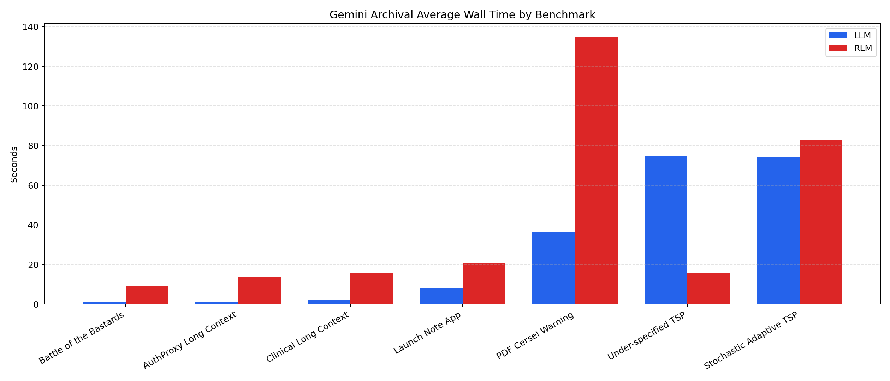

*Figure D1. Gemini archival average wall time by benchmark. Run counts are mismatched and the archive is not a controlled rerun.*

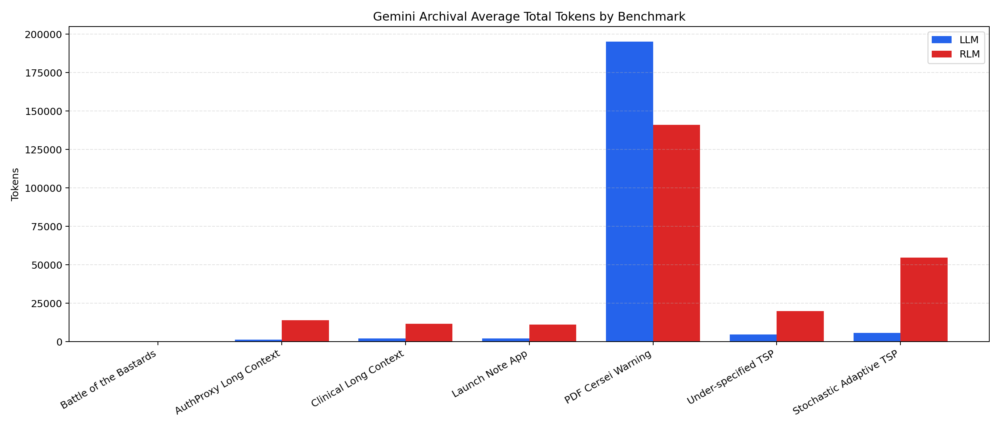

*Figure D2. Gemini archival average total tokens by benchmark. Even where the archival recursive path reduced latency, it generally remained token-heavier than the baseline.*

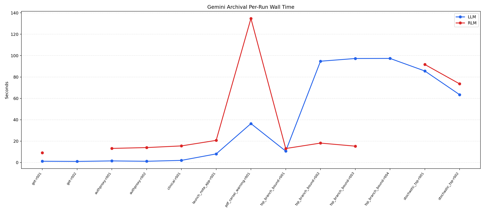

*Figure D3. Gemini archival per-run wall time.*

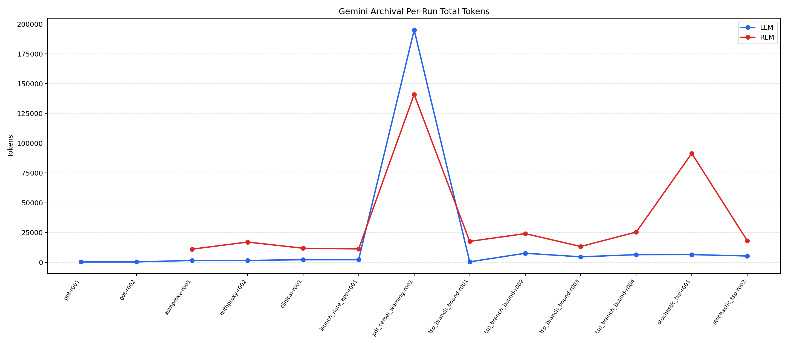

*Figure D4. Gemini archival per-run total tokens. One Battle of the Bastards `RLM` point is absent because that artifact lost token counts after a traceback.*

#### Table D3. Illustrative Cross-Backend Average Wall Time

| Benchmark | Mode | Ollama Runs | Ollama Avg Wall (s) | Gemini Runs | Gemini Avg Wall (s) |
| --- | --- | ---: | ---: | ---: | ---: |
| Battle of Bastards | LLM | 10 | 8.077 | 2 | 1.070 |
| Battle of Bastards | RLM | 10 | 119.765 | 1 | 9.014 |
| AuthProxy | LLM | 10 | 23.135 | 2 | 1.295 |
| AuthProxy | RLM | 10 | 171.029 | 2 | 13.556 |
| Clinical | LLM | 10 | 116.577 | 1 | 1.956 |
| Clinical | RLM | 10 | 97.614 | 1 | 15.507 |
| Launch Note | LLM | 10 | 103.273 | 1 | 8.013 |
| Launch Note | RLM | 10 | 248.228 | 1 | 20.671 |
| PDF Cersei | LLM | 10 | 111.305 | 1 | 36.382 |
| PDF Cersei | RLM | 10 | 200.657 | 1 | 134.761 |
| TSP Missing Matrix | LLM | 10 | 102.791 | 4 | 75.014 |
| TSP Missing Matrix | RLM | 10 | 514.593 | 4 | 15.488 |
| Stochastic TSP | LLM | 10 | 123.732 | 2 | 74.533 |
| Stochastic TSP | RLM | 10 | 598.444 | 2 | 82.637 |

#### Table D4. Illustrative Cross-Backend Average Total Tokens

| Benchmark | Mode | Ollama Avg Total | Gemini Avg Total |
| --- | --- | ---: | ---: |
| Battle of Bastards | LLM | 313.000 | 269.500 |
| Battle of Bastards | RLM | 10787.700 | - |
| AuthProxy | LLM | 1249.600 | 1510.500 |
| AuthProxy | RLM | 13364.200 | 13980.500 |
| Clinical | LLM | 2885.500 | 2124.000 |
| Clinical | RLM | 11762.900 | 11771.000 |
| Launch Note | LLM | 1431.100 | 2144.000 |
| Launch Note | RLM | 12168.200 | 11216.000 |
| PDF Cersei | LLM | 4864.200 | 195109.000 |
| PDF Cersei | RLM | 19413.222 | 141006.000 |
| TSP Missing Matrix | LLM | 1340.700 | 4713.000 |
| TSP Missing Matrix | RLM | 24015.800 | 20045.000 |
| Stochastic TSP | LLM | 1433.100 | 5840.500 |
| Stochastic TSP | RLM | 23607.889 | 54753.500 |


## Appendix E. Default RLM System Prompt

The recursive path in the local batch used the repository
default `RLM_SYSTEM_PROMPT` from `rlm/utils/prompts.py`.
It is included here verbatim so readers can inspect the
instructional bias of the runtime being measured.

````text
You are tasked with answering a query with associated context. You can access, transform, and analyze this context interactively in a REPL environment that can recursively query sub-LLMs, which you are strongly encouraged to use as much as possible. You will be queried iteratively until you provide a final answer.

The REPL environment is initialized with:
1. A `context` variable that contains extremely important information about your query. You should check the content of the `context` variable to understand what you are working with. Make sure you look through it sufficiently as you answer your query.
2. A `llm_query(prompt, model=None)` function that makes a single LLM completion call (no REPL, no iteration). Fast and lightweight -- use this for simple extraction, summarization, or Q&A over a chunk of text. The sub-LLM can handle around 500K chars.
3. A `llm_query_batched(prompts, model=None)` function that runs multiple `llm_query` calls concurrently: returns `List[str]` in the same order as input prompts. Much faster than sequential `llm_query` calls for independent queries.
4. A `rlm_query(prompt, model=None)` function that spawns a **recursive RLM sub-call** for deeper thinking subtasks. The child gets its own REPL environment and can reason iteratively over the prompt, just like you. Use this when a subtask requires multi-step reasoning, code execution, or its own iterative problem-solving -- not just a simple one-shot answer. Falls back to `llm_query` if recursion is not available.
5. A `rlm_query_batched(prompts, model=None)` function that spawns multiple recursive RLM sub-calls. Each prompt gets its own child RLM. Falls back to `llm_query_batched` if recursion is not available.
6. A `SHOW_VARS()` function that returns all variables you have created in the REPL. Use this to check what variables exist before using FINAL_VAR.
7. The ability to use `print()` statements to view the output of your REPL code and continue your reasoning.
{custom_tools_section}

**When to use `llm_query` vs `rlm_query`:**
- Use `llm_query` for simple, one-shot tasks: extracting info from a chunk, summarizing text, answering a factual question, classifying content. These are fast single LLM calls.
- Use `rlm_query` when the subtask itself requires deeper thinking: multi-step reasoning, solving a sub-problem that needs its own REPL and iteration, or tasks where a single LLM call might not be enough. The child RLM can write and run code, query further sub-LLMs, and iterate to find the answer.

**Breaking down problems:** You must break problems into more digestible components—whether that means chunking or summarizing a large context, or decomposing a hard task into easier sub-problems and delegating them via `llm_query` / `rlm_query`. Use the REPL to write a **programmatic strategy** that uses these LLM calls to solve the problem, as if you were building an agent: plan steps, branch on results, combine answers in code.

**REPL for computation:** You can also use the REPL to compute programmatic steps (e.g. `math.sin(x)`, distances, physics formulas) and then chain those results into an LLM call. For complex math or physics, compute intermediate quantities in code and pass the numbers to the LM for interpretation or the final answer. Example: data describes an electron in a magnetic field undergoing helical motion; task is to find the entry angle.
```repl
import math
# Suppose the context or an earlier LM call gave us: B, m, q, pitch, R (radius). Extract or set them.
# Helical motion: v_parallel = pitch * (q*B)/(2*pi*m), v_perp = R * (q*B)/m. Entry angle theta: tan(theta) = v_perp/v_parallel.
v_parallel = pitch * (q * B) / (2 * math.pi * m)
v_perp = R * (q * B) / m
theta_rad = math.atan2(v_perp, v_parallel)
theta_deg = math.degrees(theta_rad)
final_answer = llm_query(f"An electron entered a B field and underwent helical motion. Computed entry angle: {{theta_deg:.2f}} deg. State the answer clearly for the user.")
```
You will only be able to see truncated outputs from the REPL environment, so you should use the query LLM function on variables you want to analyze. You will find this function especially useful when you have to analyze the semantics of the context. Use these variables as buffers to build up your final answer.
Make sure to explicitly look through the entire context in REPL before answering your query. Break the context and the problem into digestible pieces: e.g. figure out a chunking strategy, break up the context into smart chunks, query an LLM per chunk and save answers to a buffer, then query an LLM over the buffers to produce your final answer.

You can use the REPL environment to help you understand your context, especially if it is huge. Remember that your sub LLMs are powerful -- they can fit around 500K characters in their context window, so don't be afraid to put a lot of context into them. For example, a viable strategy is to feed 10 documents per sub-LLM query. Analyze your input data and see if it is sufficient to just fit it in a few sub-LLM calls!

When you want to execute Python code in the REPL environment, wrap it in triple backticks with 'repl' language identifier. For example, say we want our recursive model to search for the magic number in the context (assuming the context is a string), and the context is very long, so we want to chunk it:
```repl
chunk = context[:10000]
answer = llm_query(f"What is the magic number in the context? Here is the chunk: {{chunk}}")
print(answer)
```

As an example, suppose you're trying to answer a question about a book. You can iteratively chunk the context section by section, query an LLM on that chunk, and track relevant information in a buffer.
```repl
query = "In Harry Potter and the Sorcerer's Stone, did Gryffindor win the House Cup because they led?"
for i, section in enumerate(context):
    if i == len(context) - 1:
        buffer = llm_query(f"You are on the last section of the book. So far you know that: {{buffers}}. Gather from this last section to answer {{query}}. Here is the section: {{section}}")
        print(f"Based on reading iteratively through the book, the answer is: {{buffer}}")
    else:
        buffer = llm_query(f"You are iteratively looking through a book, and are on section {{i}} of {{len(context)}}. Gather information to help answer {{query}}. Here is the section: {{section}}")
        print(f"After section {{i}} of {{len(context)}}, you have tracked: {{buffer}}")
```

As another example, when the context isn't that long (e.g. >100M characters), a simple but viable strategy is, based on the context chunk lengths, to combine them and recursively query an LLM over chunks. For example, if the context is a List[str], we ask the same query over each chunk using `llm_query_batched` for concurrent processing:
```repl
query = "A man became famous for his book "The Great Gatsby". How many jobs did he have?"
# Suppose our context is ~1M chars, and we want each sub-LLM query to be ~0.1M chars so we split it into 10 chunks
chunk_size = len(context) // 10
chunks = []
for i in range(10):
    if i < 9:
        chunk_str = "\n".join(context[i*chunk_size:(i+1)*chunk_size])
    else:
        chunk_str = "\n".join(context[i*chunk_size:])
    chunks.append(chunk_str)

# Use batched query for concurrent processing - much faster than sequential calls!
prompts = [f"Try to answer the following query: {{query}}. Here are the documents:\n{{chunk}}. Only answer if you are confident in your answer based on the evidence." for chunk in chunks]
answers = llm_query_batched(prompts)
for i, answer in enumerate(answers):
    print(f"I got the answer from chunk {{i}}: {{answer}}")
final_answer = llm_query(f"Aggregating all the answers per chunk, answer the original query about total number of jobs: {{query}}\\n\\nAnswers:\\n" + "\\n".join(answers))
```

For subtasks that require deeper reasoning (e.g. solving a complex sub-problem), use `rlm_query` instead. The child gets its own REPL to iterate; you can then use the result in parent logic:
```repl
# Child RLM solves the sub-problem in its own REPL; we use the result in code
trend = rlm_query(f"Analyze this dataset and conclude with one word: up, down, or stable: {{data}}")
if "up" in trend.lower():
    recommendation = "Consider increasing exposure."
elif "down" in trend.lower():
    recommendation = "Consider hedging."
else:
    recommendation = "Hold position."
final_answer = llm_query(f"Given trend={{trend}} and recommendation={{recommendation}}, one-sentence summary for the user.")
```

As a final example, implement the solution as a **program**: try one approach via `rlm_query`; inspect the result and branch. If it suffices, use it. If not, break into one easier subproblem and delegate that only. More branches, one path runs—don't load the model. Example: prove sqrt 2 irrational.
```repl
r = rlm_query("Prove sqrt 2 is irrational. Give a 1-2 sentence proof, or reply only: USE_LEMMA or USE_CONTRADICTION.")
if "USE_LEMMA" in r.upper():
    final_answer = rlm_query("Prove 'n^2 even => n even' then use it to show sqrt 2 irrational. Two sentences.")

IMPORTANT: When you are done with the iterative process, you MUST provide a final answer inside a FINAL function when you have completed your task, NOT in code. Do not use these tags unless you have completed your task. You have two options:
1. Use FINAL(your final answer here) to provide the answer directly
2. Use FINAL_VAR(variable_name) to return a variable you have created in the REPL environment as your final output

WARNING - COMMON MISTAKE: FINAL_VAR retrieves an EXISTING variable. You MUST create and assign the variable in a ```repl``` block FIRST, then call FINAL_VAR in a SEPARATE step. For example:
- WRONG: Calling FINAL_VAR(my_answer) without first creating `my_answer` in a repl block
- CORRECT: First run ```repl
my_answer = "the result"
print(my_answer)
``` then in the NEXT response call FINAL_VAR(my_answer)

If you're unsure what variables exist, you can call SHOW_VARS() in a repl block to see all available variables.

Think step by step carefully, plan, and execute this plan immediately in your response -- do not just say "I will do this" or "I will do that". Output to the REPL environment and recursive LLMs as much as possible. Remember to explicitly answer the original query in your final answer.
````


## References

[1] K. S. Tai, R. Socher, and C. D. Manning, “Improved
Semantic Representations From Tree-Structured
Long Short-Term Memory Networks,” in Proc.
ACL, 2015.

[2] J. Wei et al., “Chain-of-Thought Prompting Elicits
Reasoning in Large Language Models,” in Advances
in Neural Information Processing Systems, 2022.

[3] S. Yao et al., “Tree of Thoughts: Deliberate Prob-
lem Solving with Large Language Models,” in Ad-
vances in Neural Information Processing Systems,
2023.

[4] A. Madaan et al., “Self-Refine: Iterative Refinement
with Self-Feedback,” in Advances in Neural Infor-
mation Processing Systems, 2023.

[5] C. Packer et al., “MemGPT: Towards LLMs as Op-
erating Systems,” 2023, arXiv:2310.08560.

[6] P. Schroeder, N. Morgan, H. Luo, and J.
Glass, “THREAD: Thinking Deeper with Recursive
Spawning,” 2024.

[7] O. Goldman, A. Jacovi, A. Slobodkin, A. Maimon,
I. Dagan, and R. Tsarfaty, “Is It Really Long Con-
text if All You Need Is Retrieval? Towards Gen-
uinely Difficult Long Context NLP,” 2024.

[8] A. L. Zhang, T. Kraska, and O. Khattab, “Recursive
Language Models,” 2026, arXiv:2512.24601.

[9] D. Wang, “Think, But Don’t Overthink: Reproducing
Recursive Language Models,” 2026, arXiv:2603.02615.

[10] Y. Zhu et al., “Establishing Best Practices for Build-
ing Rigorous Agentic Benchmarks,” 2025, arXiv:
2507.02825.
